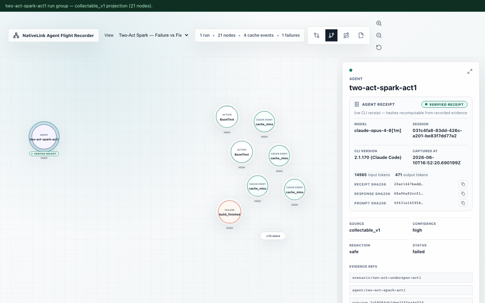
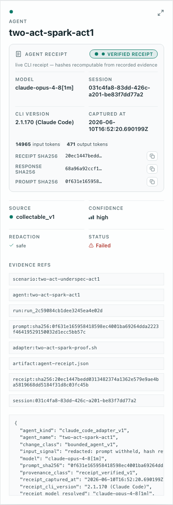
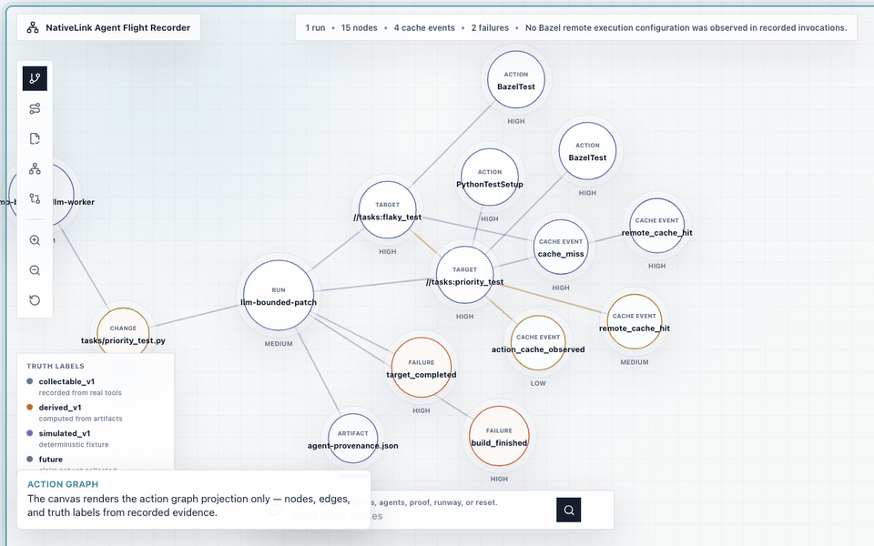
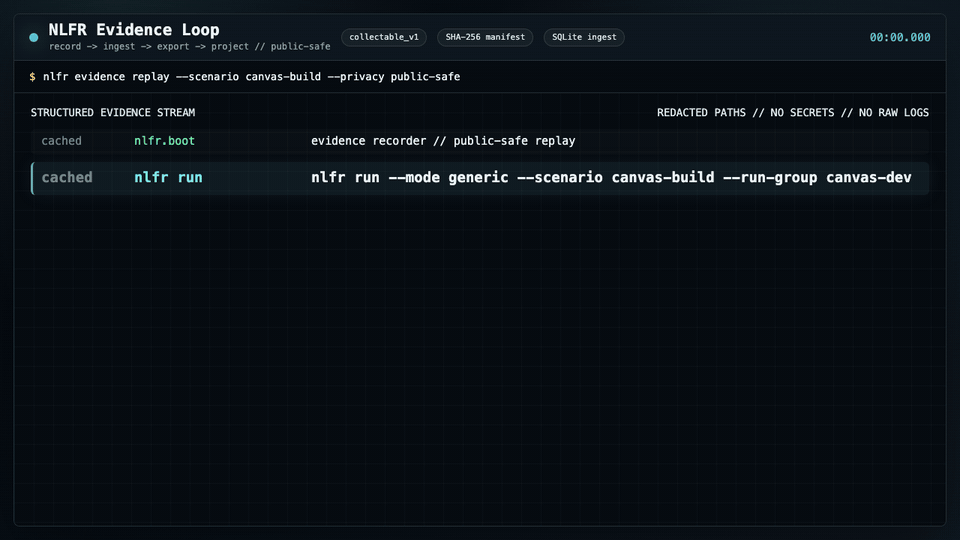

# NativeLink Agent Flight Recorder

[](https://github.com/heyitsalec/nativelink-agent-flight-recorder/actions/workflows/nlfr-proof.yml)
[](https://github.com/heyitsalec/nativelink-agent-flight-recorder/actions/workflows/nlfr-cache-only-gate.yml)
[](https://heyitsalec.github.io/nativelink-agent-flight-recorder/?view=two-act-spark)

**Point NLFR at your Bazel repo in one command — and walk away with
truth-labeled, attestable build evidence instead of a chat transcript.**

```bash
# Install today (stdlib-only recorder, zero runtime deps — no clone needed):
uv tool install "git+https://github.com/heyitsalec/nativelink-agent-flight-recorder.git"

# Record any bazel invocation on ANY Bazel repo — no NLFR config, no NativeLink deploy:
nlfr record -- bazel test //your:target
```

That one command captures the build immutably, normalizes it into SQLite, and
exports projection JSON in which **every claim is truth-labeled** —
`source_kind` / `confidence` / `evidence_refs` / `redaction_state` on every row.
You can then **attest the result** as an in-toto v1 Statement (cosign-ready):
evidence that plugs into your existing safety case / provenance stack
(SLSA · in-toto · Sigstore), not a transcript you have to trust. NLFR does not
sign for you and makes **no claim of auditor acceptance** — the honest boundary
is stated everywhere it matters.

Built for the platform engineer on a Bazel-heavy team (A/V, robotics,
safety-critical) who has to show *what actually ran* when an agent wrote the code.

### What ships today

| Capability | What it does |
| --- | --- |
| **`nlfr record`** | One-command evidence capture on any Bazel repo — wrap any `bazel` invocation ([how-to](docs/wiki/how-to/record-your-own-build.md)). |
| **Artifact-integrity verification** | Recorded SHA-256 digests re-checked and surfaced as an `artifact_verification` rollup in proof packets and the in-toto predicate. |
| **in-toto export** | `nlfr proof export --format in-toto` → unsigned, DSSE-ready in-toto v1 Statement; sign externally with cosign ([how-to](docs/wiki/how-to/export-in-toto-attestation.md)). |
| **Contract-enforced projections** | Projection JSON shape is CI-gated against committed JSON contracts ([contracts](docs/wiki/reference/contracts/README.md)). |
| **Verified agent receipts** | `receipt_verified_v1` receipts — model, session, token usage, prompt/response SHA-256; raw prompt structurally absent. Claude is live-proven in the committed two-act run; the Gemini parser is fixture-tested (live validation env-gated). |
| **`nlfr db upgrade` / `db gc`** | Schema migration and operator-consented evidence retention ([CLI reference](docs/wiki/reference/cli.md#db-upgrade)). |

The recorder is a stdlib-only Python package with **zero runtime dependencies**.
Full install matrix (git, local wheel, PyPI-when-published):
[Quickstart](#quickstart-no-nix-no-nativelink-required). The hosted canvas and
two-act demo run from a clone.

## See it in 60 seconds

1. **Hosted canvas** —
   <https://heyitsalec.github.io/nativelink-agent-flight-recorder/?view=two-act-spark>
   — the live two-act run, zero install.
2. **One proof JSON** —
   [`docs/proof-samples/two-act-spark-live-summary-sample.json`](docs/proof-samples/two-act-spark-live-summary-sample.json):
   act 1 red and attributed to the hidden target, act 2 green with warm cache
   hits, live `receipt_verified_v1` agent receipts on both acts, compare
   projection exported — every leg truth-labeled.
3. **One pager** — [`docs/ONE_PAGER.md`](docs/ONE_PAGER.md): thesis, proven
   claims, and the explicitly unproven boundaries.

## The two-act story: the recorder catches an agent being wrong

The differentiated proof point, rendered from committed evidence — not a
narrative you have to take on faith.

**Act 1** — an agent writes a patch from an underspecified task. A hidden Bazel
requirement it cannot see catches it: real `bazel test` through the NativeLink
cache goes red. The recorder captures the failure, attributes it to the hidden
target, and stores the agent's receipt (model, session, prompt SHA-256 — never
the raw prompt). **Act 2** — the agent receives the recorded failure evidence
and ships the fix: validation goes green with warm NativeLink cache hits on
unchanged targets, and a compare projection contrasts the two acts.

<p align="center">
  
  <br>
  <sub><strong>Act 1 in the canvas:</strong> the failed patch in the Action Graph, receipt badge on the agent node, receipt detail pane open — all rendered from committed projection JSON.</sub>
</p>

<p align="center">
  
  <br>
  <sub><strong>The receipt:</strong> CLI version, session, token usage, prompt/response SHA-256, truth labels, and evidence refs — the raw prompt is structurally absent.</sub>
</p>

**What is and is not real here:** everything in the committed run. The
validation and cache legs are real recorded Bazel + NativeLink evidence
(`collectable_v1`), and the agent legs carry live receipts
(`receipt_verified_v1`): a real Claude (server-resolved `claude-opus-4-8`)
authored both the failing patch and the fix, with session id, token usage, and
prompt/response SHA-256 recorded — never the raw prompt
([live summary](docs/proof-samples/two-act-spark-live-summary-sample.json) ·
[receipt](docs/proof-samples/two-act-spark-live-receipt-sample.json)).
A deterministic stub path keeps the same mechanics testable without LLM tokens
(`stub_receipt_v1`), and an unauthenticated CLI records a truth-labeled
blocker instead of faking success
([sample](docs/proof-samples/two-act-spark-live-blocker-sample.json)).

## Quickstart (no Nix, no NativeLink required)

### Install the `nlfr` CLI (pip / uvx)

The `nlfr` recorder CLI is a stdlib-only Python package with **zero runtime
dependencies**. You do not need to clone the repo to run it:

```bash
# Run straight from GitHub (works today):
uv tool install "git+https://github.com/heyitsalec/nativelink-agent-flight-recorder.git"
nlfr --help

# Or build and run a local wheel from a clone:
uv build
uvx --from dist/*.whl nlfr doctor --mode cache-only

# Once published to PyPI, pip / uvx work directly:
pip install nativelink-agent-flight-recorder
uvx --from nativelink-agent-flight-recorder nlfr --help
```

PyPI publishing is **inert until the maintainer completes trusted-publisher
setup** ([`docs/RELEASING.md`](docs/RELEASING.md)) — until then use the git or
local-wheel paths above.

### Full canvas + demo (clone)

The hosted canvas and two-act demo run from the cloned repo:

```bash
git clone https://github.com/heyitsalec/nativelink-agent-flight-recorder.git
cd nativelink-agent-flight-recorder
uv sync
uv run pytest -q                  # the full suite must pass (480+ tests as of 2026-07)
npm --prefix apps/canvas install
npm --prefix apps/canvas run dev  # http://127.0.0.1:5173/
```

Open `http://127.0.0.1:5173/?view=two-act-spark` for the two-act story above.
The default view renders **`canvas-dev`** — a real `collectable_v1` record of
NLFR building its own GUI. The canvas reads committed projection JSON only; it
never invents backend state. Real NativeLink proof runs need Nix — see
[Run Locally](#run-locally).

## The cache numbers

Real cold/warm NativeLink cache proof, inside `nix develop`:

| Leg | Wall time | Cache hit rate |
| --- | --- | --- |
| Cold | 9.04 s | 0.0 (0 hits / 2 misses) |
| Warm | 6.12 s | 1.0 (2 hits / 0 misses) |

Same target, ~2.9 s faster on a deliberately tiny fixture workload — the point
is the recorded, inspectable evidence trail, not the absolute seconds.

<sub>Recorded by CI run
[`28862144465`](https://github.com/heyitsalec/nativelink-agent-flight-recorder/actions/runs/28862144465)
on `main` (2026-07-07) under Bazel **7.4.1** — bazelisk-resolved from the demo
workspace's pinned `.bazelversion`, in Nix with NativeLink from `flake.nix`
(`collectable_v1`, `high`). Reproduce: `scripts/cold-warm-cache-proof.sh`. The
committed [`cold-warm-summary.json`](docs/proof-samples/cold-warm-summary.json)
shows the `summary.json` shape from an earlier reference recording — wall-clock
seconds drift run to run; the hit-rate pattern (cold 0.0 → warm 1.0) does not.</sub>

## Truth labels and explicit limits

Every normalized evidence row and projection object carries four fields:

- `source_kind`: `collectable_v1`, `derived_v1`, `simulated_v1`, `future`, or
  `unknown`
- `confidence`: `high`, `medium`, `low`, or `unknown`
- `evidence_refs`: artifact or fixture references backing the claim
- `redaction_state`: `safe`, `redacted`, `blocked`, or `unknown`

Agent nodes additionally carry a receipt provenance badge:
`receipt_verified_v1` (parsed live-CLI receipt — the committed two-act run),
`stub_receipt_v1` (deterministic stub used by the CI mechanics gate), or
`operator_asserted_v1` (operator claim without a receipt).

Receipts are captured through a per-CLI parser registry
([`src/nlfr/agent_receipt.py`](src/nlfr/agent_receipt.py)): `nlfr agent-invoke
--agent-cli {claude,gemini}`. Every CLI clears the same verified-tier bar
(success + response SHA-256 + session id + single server-resolved model) and the
same privacy posture (prompt hashed, raw prompt structurally rejected). The
committed two-act run is a live **Claude** receipt. The **Gemini** integration
is derived from the official Gemini CLI `--output-format json` docs and is
fixture-tested — live validation is env-gated (`NLFR_RUN_AGENT_LIVE_GEMINI=1`
with the Gemini CLI on PATH) and pending a machine with that CLI; it has not
been live-proven here.

V1 does **not** claim remote worker assignment, queue time, action placement,
scheduler assignment, load distribution, or full remote-execution fleet
behavior. Worker identity is **conditional** on M7 stdout capture — not a
wholesale fleet claim. Full claim
ledger: [`docs/ONE_PAGER.md`](docs/ONE_PAGER.md) ·
[truth-label reference](docs/wiki/reference/truth-labels.md).

## Media tour

<p align="center">
  
  <br>
  <sub><strong>Action Graph canvas:</strong> inspect the graph, proof packet, compare lens, and operator command from projection JSON.</sub>
  <br><br>
  
  <br>
  <sub><strong>Evidence loop:</strong> run Bazel through NativeLink, ingest artifacts, export projections, and inspect proof.</sub>
</p>

The public repo is credential-free and fixture-safe. Hero GIFs are generated
from committed projections with truth labels visible. If `docs/media/*.gif` is
missing locally, regenerate after building the canvas:

```bash
npm --prefix apps/canvas run capture:heroes
```

See [docs/MEDIA_CAPTURE.md](docs/MEDIA_CAPTURE.md) for tier1-demo view and scene design.

## The Loop

Agent validation gets hard to trust when the truth is scattered across chat
threads, CI logs, cache hits, and half-remembered build outcomes. NLFR turns
that scattered work into one loop:

1. **Record.** Run a Bazel workload through a NativeLink cache or local-exec
   path; capture Bazel BEP, stdout, profile, execution log, and NativeLink
   config/log artifacts immutably with SHA-256 hashes.
2. **Ingest.** Normalize artifacts into SQLite with idempotent keys, stable
   run groups, and four truth labels on every row.
3. **Project.** Export versioned projection JSON and proof packets — Action
   Graph nodes, edges, metrics, and claims carry `source_kind`, `confidence`,
   `evidence_refs`, and `redaction_state`.
4. **Inspect.** The sparse canvas renders only from projection JSON: Action
   Graph, Proof Packet, Remote Boundary, failure focus, and agent-loop chain.
5. **Compare.** Export compare projections across run groups to contrast cold
   vs warm cache, fixture vs dogfood, or successive proof runs without
   re-running the workload. See [Compare runs (M9)](docs/wiki/compare-runs.md).

## What You Get

| Surface | What it shows |
| --- | --- |
| Python recorder CLI | `nlfr run`, `ingest`, `graph export`, `proof export`, `compare export`, `simulate`, and `doctor` over the evidence spine. |
| SQLite evidence spine | Immutable artifact manifest, idempotent ingest, Bazel/NativeLink parsers, and truth-labeled rows. |
| Projection JSON | Action Graph, proof packet, compare lens, and runway exports consumed by the canvas and proof scripts. |
| Sparse canvas | Vite/React app under `apps/canvas/` that renders projection JSON only — no invented scheduler or worker state. |
| Proof lane | `pytest`, `./scripts/verify-demo.sh`, Nix proof scripts, and local gates. |

Still frames from the same projection sources: [docs/media/README.md](docs/media/README.md).

## Run Locally

Requirements: `uv`, Python 3.11+, Node/npm for the canvas app. No environment
variables are required for the fixture path. The fixture-backed evaluator path
is the [Quickstart](#quickstart-no-nix-no-nativelink-required) above; full
fixture ingest, export, and simulated-agent commands:
[docs/ADOPTION_GUIDE.md](docs/ADOPTION_GUIDE.md) (5-minute path).

### Real NativeLink proof (Nix)

Outside `nix develop`, real-tool scripts record truth-labeled
`environment_blocker` evidence. Inside Nix (NativeLink from `flake.nix`; Bazel
bazelisk-resolved from each workspace's `.bazelversion` — 7.4.1 for the bundled
demo) the recorder has proven cold/warm cache, one-process local-exec, live two-worker
endpoint readiness, worker admin stdout (M7), agent-loop closure, tier1 live
Bazel, two-act spark mechanics, and LRE readiness probes:

```bash
nix develop
scripts/cold-warm-cache-proof.sh
scripts/local-exec-proof.sh
NLFR_EXPECTED_WORKERS=2 NLFR_LOCAL_EXEC_OUTPUT=$PWD/data/local-exec-proof-2w \
  scripts/local-exec-proof.sh
scripts/worker-evidence-proof.sh
scripts/agent-loop-proof.sh
./scripts/tier1-live-bazel-proof.sh
./scripts/lre-proof.sh
./scripts/lre-cold-warm-proof.sh
./scripts/lre-nix-toolchain-proof.sh
```

These write `summary.json` evidence under `data/cold-warm-proof/`,
`data/local-exec-proof/`, `data/worker-evidence-proof/`, `data/agent-loop-proof/`,
`data/tier1-live-bazel/`, and `data/lre-proof/`. The two-worker run proves two
workers configured AND endpoints opened live (`worker_endpoints_ready`,
`expected_workers=2`) — not work distributed across two workers.

**M7 worker identity (conditional):** when admin stdout rows are attached and
match the parser, projections promote `worker_identity` as `collectable_v1` with
`high` confidence (`worker-evidence-proof.sh` → `worker_identity_observed:
true`). Without direct stdout evidence, worker identity is not claimed.

On hosts without Bazel or NativeLink, real-tool paths record durable
`environment_blocker` evidence. That is a valid host readiness result, not a
successful worker-execution claim.

Prerequisites (~82GB disk for first proof run): [docs/DEV_ENVIRONMENT.md](docs/DEV_ENVIRONMENT.md).

### Tier 1 canvas preview

After `promote-tier1-compare.sh` or committed tier1 projections:

```bash
npm --prefix apps/canvas run preview
```

Open `http://127.0.0.1:5174/?view=tier1-demo` for the Compare lens with
`collectable_v1` dogfood pairs.

### Full verifier (local proof gates)

```bash
scripts/verify-demo.sh
```

Runs backend tests, doctor, real-tool smoke (blocker or success), cold/warm,
local-exec, worker-evidence, simulated-agent provenance, fixture ingest,
projection exports, and canvas build. Optional Nix scripts above extend the
same spine.

Canonical spine:

```bash
python3 -m pytest
python3 -m nlfr doctor --mode cache-only
python3 -m nlfr run --scenario tri-agent-loop --mode cache-only --target //...
python3 -m nlfr graph export --run-group latest
python3 -m nlfr proof export --run-group latest
```

CI reproduction recipe: [docs/CI_RECIPE.md](docs/CI_RECIPE.md).

## Documentation

Start at the [documentation hub](docs/INDEX.md) for the two-hop review map
(tutorial, how-to, reference, explanation).

| Intent | Where to go |
| --- | --- |
| Founder/evaluator tryout paths | [Tryout packet](docs/TRYOUT_PACKET.md) |
| First guided tour | [Walkthrough](docs/WALKTHROUGH.md) |
| Adoption paths (fixture + Nix) | [Adoption guide](docs/ADOPTION_GUIDE.md) |
| Architecture + milestones | [Architecture track](docs/ARCHITECTURE_TRACK.md) |
| Compare lens + M9 proof | [Compare runs](docs/wiki/compare-runs.md) |
| Proof samples + tryout | [proof-samples/](docs/proof-samples/README.md) |
| Contributor rules | [Contributing](docs/CONTRIBUTING.md) |
| Security policy + threat model | [SECURITY.md](SECURITY.md) · [threat model](docs/SECURITY_MODEL.md) |

Depth pages live under [`docs/wiki/`](docs/wiki/) (evidence loop, truth labels,
ADR-lite decisions). How this repo was built:
[docs/internal/METHOD.md](docs/internal/METHOD.md).

## Status And Limits

NLFR v1 is an evidence-first recorder MVP, not a hosted SaaS, multi-tenant
control plane, or full remote-execution fleet dashboard.

**CI status:** GitHub Actions runs on every push to `main` and the recorded runs
are green — see the **NLFR proof** and **Cache-only gate** badges at the top of
this README. Local gates (`uv run pytest -q` and `./scripts/verify-demo.sh`)
remain the reproducible canonical verification anyone can run without our
infrastructure. The CI matrix is documented in
[docs/CI_RECIPE.md](docs/CI_RECIPE.md).

**M5–M9 + two-act spark (landed):**

| Milestone | Delivers |
| --- | --- |
| M5 | Linux CI workflow + adoption docs (`nlfr-proof.yml`; proof samples author-Nix until GHA promotes) |
| M6 | Real default projection (`canvas-dev` `collectable_v1`) + fixture fallback banner |
| M7 | `worker_admin_stdout` parser + `worker-evidence-proof.sh` (conditional `worker_identity`) |
| M8 | Agent adapter (`record-agent-change.sh`; model + `prompt_sha256` only) |
| M9 | `compare export` / `compare index`, compare lens, `compare-proof.sh` |
| Two-act spark | Recorded fail→fix with live `receipt_verified_v1` agent receipts + canvas receipt lens (stub path retained as CI mechanics gate) |

Out of scope for v1: SaaS/auth/billing/multi-tenancy, fleet scheduler dashboards,
OTLP/Jaeger clone, persistent worker security claims, and unsupported
worker/action/queue-time correlation beyond direct artifact evidence.

Implementation plan: [docs/internal/IMPLEMENTATION_DAG.md](docs/internal/IMPLEMENTATION_DAG.md).

## Contributing

NLFR is intentionally conservative:

- public artifacts must stay fixture-safe and credential-free;
- the recorder owns durable evidence and projection authority;
- the canvas must not invent backend state or write directly to SQLite;
- parser, projector, and truth-label changes need fixture-backed tests;
- user-visible UI changes should include screenshot or media proof.

Start with [docs/CONTRIBUTING.md](docs/CONTRIBUTING.md) before changing code.

## License

Apache-2.0. See [LICENSE](LICENSE) and [NOTICE](NOTICE).
