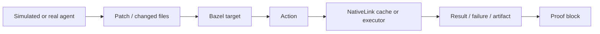

# Remote Execution Expansion Plan

> **Historical snapshot.** This expansion plan records the zero-LLM
> remote-execution phase strategy predating M5–M9.
> For current product truth and milestone status, use **[ONE_PAGER.md](ONE_PAGER.md)**
> and **[ARCHITECTURE_TRACK.md](ARCHITECTURE_TRACK.md)**.
> Deep dives: **[Wiki hub](wiki/README.md)**.

## Why This Matters

The cache-only proof shows the first part of the thesis: repeated validation can
reuse previous build/test outputs. Remote execution shows the second part:
agent-generated validation work can fan out across workers instead of piling up
inside one CI runner or developer machine.

The point is not to spend tokens on many real agents. The point is to show that
NativeLink makes the validation workload scalable once many agents exist.

## Current Implementation Slice

NLFR now has an experimental one-process remote-executor smoke path:

- `nlfr run --mode local-exec`
- `demo/nativelink/local-execution.json5`
- `scripts/local-exec-proof.sh`
- `nlfr doctor --mode local-exec`

See `docs/LOCAL_EXECUTION_DAG.md` for the local-execution worker-proof plan.

This path adds Bazel `--remote_executor` support and a one-process NativeLink
config with:

- CAS/AC services;
- execution service;
- capabilities service advertising remote execution;
- private worker API;
- one local NativeLink worker.

This is not yet a full NativeLink Local Remote Execution (LRE) demo. Full LRE
will need the NativeLink/Bazel toolchain setup, generated Bazel config, platform
properties, and a supported Linux/x86_64-style environment. Once those exist,
operators can pass the generated Bazel flags, usually including `--config=lre`,
through NLFR with repeatable `--bazel-arg=...` passthroughs.

On hosts without Bazel or NativeLink, the script writes
`environment-blocker.json` and stops. That is intentional. It keeps the proof
honest.

## Phase Plan

### Phase 1: Zero-LLM Local Proof

Use deterministic simulated agents.

- `nlfr simulate` applies predefined patches.
- `nlfr run --mode cache-only` or `--mode local-exec` validates them.
- NLFR records artifacts, provenance, proof packets, and action graph nodes.

Token usage: zero.

### Phase 2: Local Remote Execution Smoke

Run NativeLink local execution on a reproducible Linux-like environment:

- devcontainer;
- Nix shell;
- local Linux VM;
- WSL2 on the Windows gaming PC.

Start with a one-process smoke, then one worker, then two workers. The first
acceptance gate is not speed. It is evidence:

- `scripts/local-exec-proof.sh` writes `worker-readiness.json`;
- Bazel emits BEP/profile/execution-log artifacts;
- `nlfr ingest <artifact_root>` attaches those artifacts to the run;
- proof packet reports what was collectable, derived, future, or unsupported;
- action graph shows agent, patch, target, action, cache/execution evidence, and
  failure/proof blocks.

`worker-readiness.json` is intentionally conservative. It can prove that the
NativeLink config declares the expected worker count and that smoke endpoints
opened. It does not prove worker registration, action placement, queue time,
scheduler assignment, or load distribution.

For the future two-worker gate, run with a config that declares at least two
workers and set:

```bash
NLFR_EXPECTED_WORKERS=2 scripts/local-exec-proof.sh
```

With the current one-worker config, that command must stop at
`configuration_blocker`.

When moving toward full LRE, pass generated Bazel flags explicitly, for example:

```bash
nlfr run --mode local-exec \
  --bazel-arg=--config=lre \
  --bazel-arg=--remote_default_exec_properties=cpu_count=1 \
  //tasks:priority_test
```

Token usage: zero.

### Phase 3: One Real Agent Spark

Add one real LLM-generated patch after the worker path is stable.

This is for narrative authenticity, not load generation. The backbone remains
deterministic simulated agents so the demo is repeatable.

Expected token usage: low to medium, bounded by one patch/test loop.

### Phase 4: Multi-Machine Worker Demo

Use the Windows gaming PC only after the local proof works.

Best options:

1. WSL2/Linux worker on the Windows PC.
2. Docker worker if NativeLink's containerized worker setup is the fastest path.
3. Keep the scheduler/cache on the Mac or a small Linux VM and point the Windows
   worker at the private worker API over the LAN.

The demo claim should stay conservative:

> Bazel was configured to use a NativeLink remote execution endpoint, and NLFR
> recorded the evidence path.

Do not claim exact queue time, fleet scheduling behavior, or worker identity
without M7 admin stdout attachment until NLFR captures direct worker evidence
for scheduler assignment, placement, and load distribution.

## What The Operator Should See

The visual target is still the canvas:



As remote execution matures, the graph can split `NativeLink cache or executor`
into:

- scheduler;
- worker;
- CAS/AC;
- action result;
- cache reuse.

Those nodes should appear only when backed by collectable evidence.

## Right-Sizing Rule

Build NativeLink worker proof before spending LLM tokens.

The tryout-grade demo should feel impressive because the validation substrate is
real, not because many expensive agents generated noisy patches. Deterministic
agents create repeatable load; NativeLink is the substrate we are proving for
future acceleration/distribution; NLFR proves inspectability of the evidence we
actually captured.
