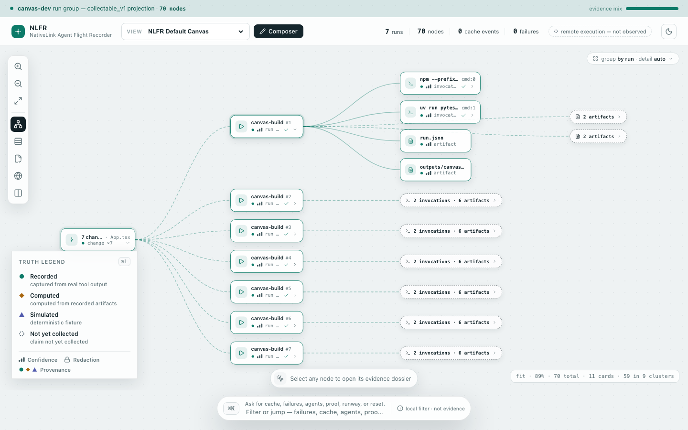
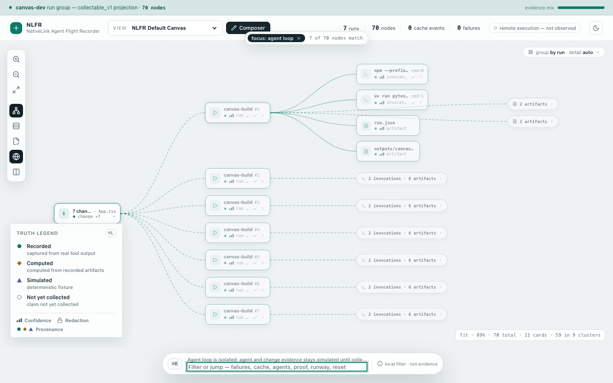
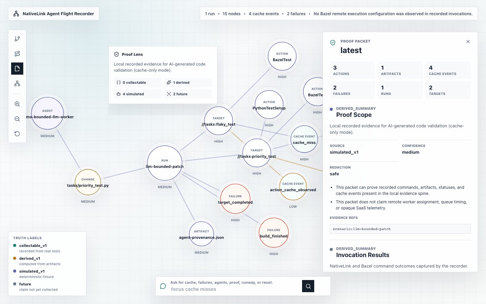
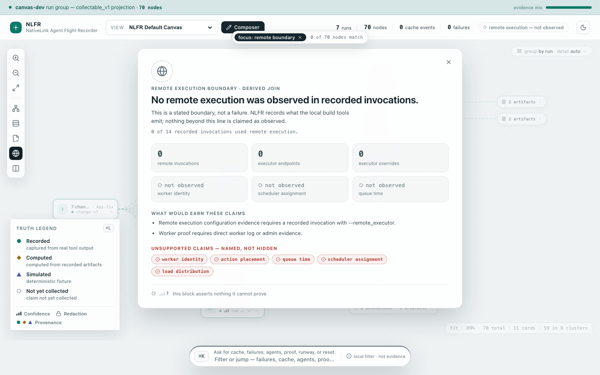
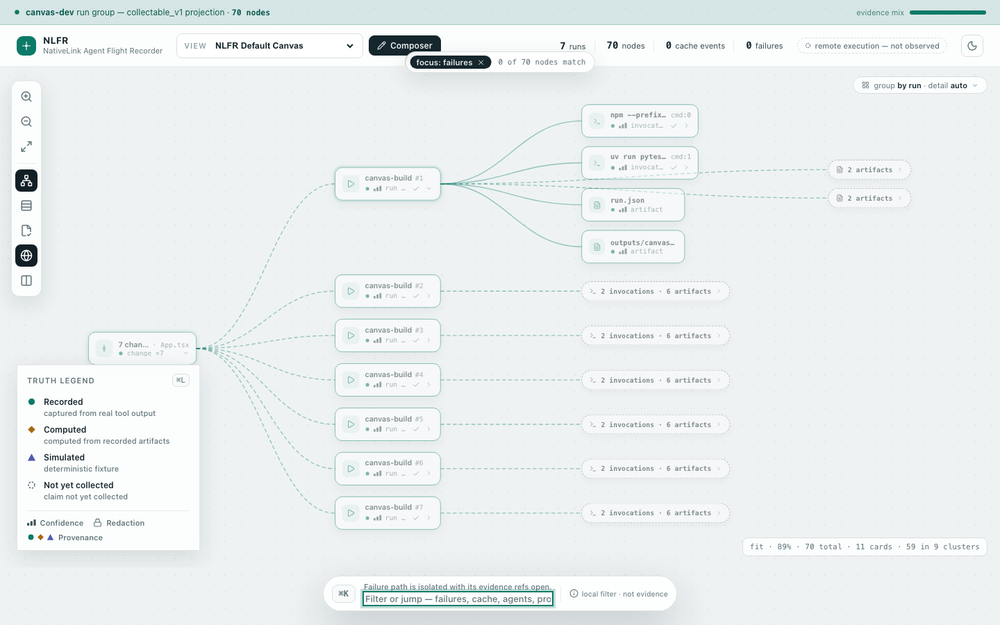
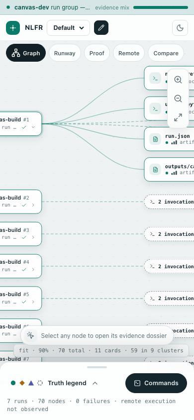

# NLFR walkthrough

← [Docs index](INDEX.md) · [Wiki hub](wiki/README.md)

**Quadrant:** Tutorial · **Audience:** evaluators learning the system shape.

This is the guided tour for understanding the NativeLink Agent Flight Recorder
(NLFR) as it exists today. Read it with the repo open. The goal is to move from
the product idea to the concrete files, commands, screenshots, and proof
artifacts that make the MVP work.

If you only read one path, follow this order:

1. This file for the system shape and demo flow.
2. [`IMPLEMENTATION_WALKTHROUGH.md`](IMPLEMENTATION_WALKTHROUGH.md) for the
   file-by-file code tour.
3. [`USEFULNESS_ROADMAP.md`](USEFULNESS_ROADMAP.md) for what is needed to make
   NLFR useful beyond the demo.

## What NLFR is

NLFR is a local-first black-box recorder for agent validation loops. It does
not try to become a CI system, dashboard, tracing stack, or SaaS product in the
MVP. It records evidence from a Bazel/NativeLink validation path, normalizes it
into SQLite, exports truth-labeled projection JSON, and renders a sparse canvas
from that projection only.

The short thesis from [`ONE_PAGER.md`](ONE_PAGER.md):

> When AI writes the code, NativeLink makes validating it fast, and NLFR makes
> validating it trustworthy.

The repo rule that matters most:

> Build an evidence-first recorder, not a UI-first dashboard.

That means every node, edge, metric, and proof claim needs truth labels:

- `source_kind`: `collectable_v1`, `derived_v1`, `simulated_v1`, or `future`.
- `confidence`: `high`, `medium`, `low`, or `unknown`.
- `evidence_refs`: artifact or fixture references backing the claim.
- `redaction_state`: `safe`, `redacted`, `blocked`, or `unknown`.

## Default canvas projection (M6) — no contradiction

Two projections serve different evaluator intents:

| Projection | Location | `source_kind` | Purpose |
|------------|----------|---------------|---------|
| **canvas-dev** (default) | `apps/canvas/public/projections/` | `collectable_v1` | Dogfood record of NLFR building its GUI (`record-canvas-build.sh`) |
| **Demo fixtures** | `data/demo-proof/projections/` after `verify-demo.sh` | `simulated_v1` | Agent-loop teaching shape; not committed as default |

The dev/preview server loads **`canvas-dev`** by default. Green banner =
`collectable_v1` dogfood. `verify-demo.sh` does **not** overwrite committed
`apps/canvas/public/projections/`.

If projections fail to load, the canvas shows a **fixture fallback banner**
(`usingFixtureFallback` in `App.tsx`) and uses committed demo fixtures — honest
`simulated_v1`, not fake live proof.

**Screenshots below** (`docs/images/canvas-*.png`) are **fixture-backed**
`simulated_v1` captures for teaching the UI surface. They intentionally show the
agent-loop graph shape. When you open preview, expect **canvas-dev** labels on
the banner — not the purple simulated nodes in the screenshots.

## The current app in pictures

These screenshots are fixture-backed `simulated_v1` canvas renders. They are
useful for understanding the current app surface, not for claiming live
NativeLink execution or the committed canvas-dev default. The real proof
summaries live in [`proof-samples/`](proof-samples/), and the real scripts write
under ignored `data/`.

### Action Graph



This is the main canvas. The walkthrough image renders fixture
`action-graph.json` shape. The committed default is `canvas-dev` under
`apps/canvas/public/projections/`. The graph shows the evidence chain:

`agent -> change -> run -> target -> action -> cache_event`

The bottom-left legend explains the truth labels. Purple nodes are simulated
fixture evidence in the no-Nix demo. Green is reserved for collectable evidence
from real tool output.

### Agent-loop focus



Typing `agent loop` in the operator input isolates the deterministic
bounded-agent patch provenance: the agent node, the change node, and their
relationship to the validation run.

Important honesty point: this is not a live LLM call. The scenario carries a
`model` label and `prompt_sha256`, but the raw prompt is never stored and no
tokens are spent. Contrast with M8 `record-agent-change.sh` and tier1-live-bazel
samples (`collectable_v1` agent leg).

### Proof Packet



The Proof Packet is the "what can we actually claim?" view. It summarizes scope,
invocations, cache evidence, validation surface, artifacts, stored proof blocks,
and unsupported claims.

### Remote Boundary



The Remote Boundary lens is intentionally conservative. It can show when a
recorded Bazel invocation was configured with remote execution or when a proof
script observed worker endpoints. **Worker identity** is **conditional** (M7):
promoted to `collectable_v1` when admin stdout is attached pre-ingest and the
M7 regex matches — see `worker-evidence-proof.sh`. Scheduler assignment, queue
time, action placement, and load distribution stay unsupported without direct
evidence.

### Failure focus



Typing `failures` isolates failure nodes and opens the evidence inspector. The
point is not to hide failed validation; the point is to make failed proof
inspectable and labeled.

### Mobile shape



The canvas is sparse and responsive enough for inspection, but mobile is not the
primary MVP surface.

### Operator flow video

<video controls src="images/canvas-operator-flow.webm" width="900"></video>

If your Markdown renderer does not play WebM inline, open
[`images/canvas-operator-flow.webm`](images/canvas-operator-flow.webm).

To regenerate these assets from a running canvas dev/preview server:

```bash
npm --prefix apps/canvas run dev -- --host 127.0.0.1
CANVAS_URL=http://127.0.0.1:5174/ npm --prefix apps/canvas run capture
cp output/playwright/canvas-*.png docs/images/
cp output/playwright/canvas-operator-flow.webm docs/images/
```

The committed files in `docs/images/` are the walkthrough copies. Fresh captures
land in ignored `output/playwright/` first.

## M7 — Worker identity (landed)

M7 promotes **one** fleet claim when direct stdout evidence exists.

| Piece | Path |
|-------|------|
| Parser | `src/nlfr/ingest/worker_admin_stdout.py` |
| Proof script | `scripts/worker-evidence-proof.sh` |
| Output | `data/worker-evidence-proof/summary.json` (`worker_identity_observed`) |
| Fleet stdout attach | `scripts/local-exec-proof.sh` (live path) |

Default proof mode is **fixture-replay** (no Nix required). Live path chains
`local-exec-proof.sh` when `nativelink` and Bazel are on PATH.

```bash
./scripts/worker-evidence-proof.sh
# fixture: NLFR_WORKER_EVIDENCE_FIXTURE_ONLY=1 (implicit when tools absent)
```

Deep dive: [Wiki § M7](wiki/README.md#frontier-tracks-pointers) · [`dags/m7-worker-parser.md`](dags/m7-worker-parser.md) · [`dags/fleet-evidence-v1.md`](dags/fleet-evidence-v1.md)

**Claim boundary:** regex match on attached stdout only — not scheduler, queue, or placement.

## M8 — Real agent adapter (landed)

Thin Cursor adapter records **`model` + `prompt_sha256`** — never raw prompts.

| Piece | Path |
|-------|------|
| Recorder | `scripts/record-agent-change.sh` |
| Docs | [`adapters/cursor/README.md`](../adapters/cursor/README.md) |
| Live Bazel acts | `scripts/tier1-live-bazel-proof.sh` → `agent-bugfix-summary.json`, `agent-feature-summary.json` |

```bash
./scripts/record-agent-change.sh --change-path README.md --model composer-2.5 \
  --prompt-file /tmp/prompt.txt --dry-run
```

`agent-loop-proof.sh` still uses a **simulated_v1** bounded patch on the agent
leg; tier1-live-bazel proves the **collectable_v1** adapter path with
`bazel_validated: true`.

Deep dive: [Wiki § M8](wiki/README.md#frontier-tracks-pointers) · [`dags/m8-agent-adapter.md`](dags/m8-agent-adapter.md)

## M9 — Multi-run compare (landed)

Compare is **`derived_v1`** — diffs across run groups, no worker correlation.

| Piece | Path |
|-------|------|
| CLI | `nlfr compare export`, `nlfr compare index` |
| Projector | `src/nlfr/projectors/compare.py` |
| Proof script | `scripts/compare-proof.sh` |
| Canvas | Compare Runs lens (`compare-projection.json`) |

```bash
PYTHONPATH=src uv run python -m nlfr compare index --db data/record-proof/nlfr.sqlite --json
PYTHONPATH=src uv run python -m nlfr compare export \
  --left-db data/record-proof/nlfr.sqlite \
  --right-db data/canvas-dev/nlfr.sqlite \
  --left record-proof --right canvas-dev \
  --output data/compare-proof/projections/compare-projection.json
./scripts/compare-proof.sh
```

Deep dive: [Export and compare run groups](wiki/how-to/export-and-compare-run-groups.md) · [`dags/m9-multi-run-compare.md`](dags/m9-multi-run-compare.md)

## LRE proof ladder (high level)

Local Remote Execution proofs advance in phases. Each phase has a script and
optional CI job — see [`CI_RECIPE.md`](CI_RECIPE.md). GHA may be offline; run
locally inside `nix develop`.

| Phase | Claim ceiling | Script | CI job |
|-------|---------------|--------|--------|
| 1 | `lre_substrate_ready` | `lre-proof.sh` | `lre-proof-probe` |
| 2 | `lre_bazelrc_generated` | `lre-nix-toolchain-proof.sh` | `lre-nix-ci` |
| 4 | `lre_cache_parity_observed` | `lre-cold-warm-proof.sh` | `lre-cold-warm-ci` |

Phase 4 expects x86_64-linux + generated `lre.bazelrc` + `demo/nativelink/lre.json5`
+ Bazel `--config=lre`. Darwin and missing toolchain produce honest
`environment-blocker.json` samples in [`proof-samples/`](proof-samples/).

Deep dive: [Wiki § LRE](wiki/README.md#frontier-tracks-pointers) · [`dags/lre-proof.md`](dags/lre-proof.md)

**Unsupported:** hermetic container-image parity, fleet dashboards, queue/action correlation.

## How someone uses the demo today

There are two evaluator paths.

### Path A: fixture-backed canvas, no Nix

Use this when the evaluator wants to understand the interface quickly.

```bash
uv sync
npm --prefix apps/canvas install
uv run pytest tests -q
scripts/verify-demo.sh
npm --prefix apps/canvas run preview -- --host 127.0.0.1
```

Then open the Vite URL and drive the operator bar:

- `agent loop` highlights agent/change provenance.
- `proof` opens the proof packet.
- `remote` opens the remote boundary lens.
- `failures` isolates failure evidence.
- `cache` highlights cache events.
- `reset` returns to the full graph.

What this path proves:

- The backend tests pass.
- Fixture evidence can be ingested and projected.
- The canvas can render projection JSON.
- Committed **canvas-dev** default is `collectable_v1` dogfood.

What this path does not prove:

- Live NativeLink cache behavior.
- Live remote execution worker behavior (beyond fixture shapes).
- Live LLM agent behavior.

### Path B: real Nix proof path

Use this when the evaluator is a skeptic and wants to re-run evidence.

```bash
nix develop
scripts/cold-warm-cache-proof.sh
NLFR_EXPECTED_WORKERS=2 NLFR_LOCAL_EXEC_OUTPUT=$PWD/data/local-exec-proof-2w \
  scripts/local-exec-proof.sh
scripts/worker-evidence-proof.sh
scripts/agent-loop-proof.sh
./scripts/tier1-live-bazel-proof.sh   # optional Acts 1+2
```

The scripts write summaries and projections under ignored `data/`. Redacted
copies of representative summaries are committed in
[`proof-samples/`](proof-samples/).

What this path proves today:

- Cold/warm NativeLink cache behavior can be recorded from real tool output.
- A warm cache leg recorded higher hit rate and lower duration in the current
  proof sample.
- Two local worker endpoints can be configured and observed live.
- Worker identity when M7 stdout is attached (`worker-evidence-proof.sh`).
- A deterministic bounded-agent patch can be linked to validation/cache evidence
  through the action graph.
- Tier1 acts with live Bazel when `tier1-live-bazel-proof.sh` completes.

What remains explicitly unproven:

- Scheduler assignment, queue time, action placement, load distribution.
- Multi-machine fleet behavior.
- Production AI-agent identity/auth beyond M8 bounded fields.
- Worker identity **without** attached admin stdout matching M7 regex.

## The system architecture

The core architecture is a one-way evidence pipeline:

```text
Bazel / NativeLink / scenario
  -> immutable artifacts with SHA-256 hashes
  -> SQLite evidence spine
  -> projection JSON
  -> canvas and proof docs
```

The UI is last on purpose. The canvas does not query Bazel, NativeLink, logs, or
an API at runtime. It reads projection JSON from `apps/canvas/public/projections/`.

### Layer 0: commands

The CLI starts at `src/nlfr/cli.py` and registers subcommands through
`src/nlfr/commands/__init__.py`.

The commands you will use most:

- `nlfr doctor`: environment readiness.
- `nlfr run`: run Bazel/NativeLink and record process artifacts.
- `nlfr ingest`: parse Bazel evidence into SQLite.
- `nlfr graph export`: export Action Graph JSON.
- `nlfr proof export`: export Proof Packet JSON.
- `nlfr runway export`: export Validation Runway JSON.
- `nlfr compare export` / `compare index`: M9 multi-run compare (`derived_v1`).
- `nlfr simulate`: apply deterministic agent patch scenarios and record
  provenance.

### Layer 1: artifact capture

`src/nlfr/artifacts.py` owns immutable artifact writes. It hashes bytes with
SHA-256, writes each artifact once, and appends `artifact_manifest.json`.

This is the "do not trust memory" layer. If a proof refers to a file, that file
has a manifest entry, hash, size, producer command, redaction state, source kind,
confidence, and evidence refs.

### Layer 2: SQLite evidence spine

`src/nlfr/db/schema.py` defines the core tables:

- `runs`
- `changes`
- `invocations`
- `artifacts`
- `targets`
- `actions`
- `cache_events`
- `failures`
- `graph_nodes`
- `graph_edges`
- `proof_blocks`

All core rows carry the truth-label columns. This is what prevents the UI from
accidentally implying a stronger claim than the recorder captured.

### Layer 3: ingest

`src/nlfr/ingest/bazel.py` parses compact Bazel evidence:

- BEP JSON/JSONL into targets, actions, and failures.
- Execution log JSON into cache events.
- Bazel profile JSON into derived cache observations.

`src/nlfr/ingest/worker_admin_stdout.py` (M7) parses admin stdout for conditional
`worker_identity` promotion.

`src/nlfr/ingest/sqlite.py` inserts parsed evidence into the schema with stable
keys so ingest is idempotent.

### Layer 4: projectors

Projectors read SQLite and export versioned JSON:

- `src/nlfr/projectors/graph.py` creates nodes and edges for the Action Graph.
- `src/nlfr/projectors/proof.py` creates proof blocks and cache economics.
- `src/nlfr/projectors/runway.py` creates a simplified validation sequence.
- `src/nlfr/projectors/compare.py` creates M9 compare projection (`derived_v1`).
- `src/nlfr/projectors/remote_execution.py` sanitizes and gates remote-execution
  claims.

This layer is where truth labels become visible product behavior.

### Layer 5: canvas

The canvas is in `apps/canvas/src/`. The central file is `App.tsx`.

It fetches:

- `/projections/action-graph.json`
- `/projections/proof.json`
- `/projections/compare-projection.json` (optional — Compare Runs lens)

Then it renders:

- Action Graph nodes and edges.
- Proof Packet drawer.
- Remote Boundary lens.
- Compare Runs lens (M9).
- Validation Runway overlay.
- Operator command input.
- Truth-label legend.

The layout is deterministic (`layout.ts`) and the types are explicit
(`types.ts`).

## Walk the repo in this order

Start here:

1. `AGENTS.md` for product and engineering rules.
2. `README.md` for the quick-start and current proof paths.
3. `docs/ONE_PAGER.md` for the shortest product framing.
4. `docs/DEMO_SCRIPT.md` for the rehearsal path.
5. `docs/proof-samples/README.md` and the JSON samples.
6. [Wiki hub](wiki/README.md) for Diátaxis deep links.

Then trace the backend:

1. `src/nlfr/cli.py`
2. `src/nlfr/commands/run_cmd.py`
3. `src/nlfr/artifacts.py`
4. `src/nlfr/db/schema.py`
5. `src/nlfr/commands/ingest_cmd.py`
6. `src/nlfr/ingest/bazel.py`
7. `src/nlfr/ingest/worker_admin_stdout.py`
8. `src/nlfr/ingest/sqlite.py`
9. `src/nlfr/projectors/graph.py`
10. `src/nlfr/projectors/proof.py`
11. `src/nlfr/projectors/compare.py`
12. `src/nlfr/commands/simulate_cmd.py`
13. `src/nlfr/commands/compare_cmd.py`

Then trace the UI:

1. `apps/canvas/public/projections/action-graph.json`
2. `apps/canvas/public/projections/proof.json`
3. `apps/canvas/src/types.ts`
4. `apps/canvas/src/layout.ts`
5. `apps/canvas/src/App.tsx`
6. `apps/canvas/src/styles.css`
7. `apps/canvas/scripts/capture-proof.mjs`

Then trace the proofs:

1. `scripts/verify-demo.sh`
2. `scripts/cold-warm-cache-proof.sh`
3. `scripts/local-exec-proof.sh`
4. `scripts/worker-evidence-proof.sh`
5. `scripts/agent-loop-proof.sh`
6. `scripts/compare-proof.sh`
7. `scripts/tier1-live-bazel-proof.sh`
8. `scripts/lre-proof.sh` (LRE phase 1)

Finally read the tests:

1. `tests/test_cli.py`
2. `tests/test_ingest_bazel.py`
3. `tests/test_projectors.py`
4. `tests/test_simulate_cmd.py`
5. `tests/test_compare.py`
6. `tests/test_worker_admin_stdout.py`
7. `tests/test_artifacts.py`

## The key mental model

NLFR is not trying to say "the build is good" or "the agent was smart."

It is trying to say:

1. Here is exactly what ran.
2. Here are the artifacts we captured.
3. Here are their hashes.
4. Here is what we parsed into SQLite.
5. Here is the projection JSON.
6. Here is what the canvas can show.
7. Here are the claims we still cannot make.

That last item is not a weakness of the demo. It is the product's differentiator.

## Where the MVP stops

The MVP is now credible as a local proof kit. It is not yet "actually useful" as
a day-to-day platform tool for a team. The largest missing pieces are covered in
[`USEFULNESS_ROADMAP.md`](USEFULNESS_ROADMAP.md), but the short version is:

- Package the reference architecture so another repo can adopt it quickly.
- Multi-run history and comparison are **landed** (M9) — retention is index-only.
- Make proof exports easy to attach to PRs or CI artifacts.
- Preserve the evidence spine while improving operator ergonomics.
- Do not build SaaS/auth/billing or a worker dashboard before direct evidence
  exists for the claims those surfaces would imply.

← [Docs index](INDEX.md)
