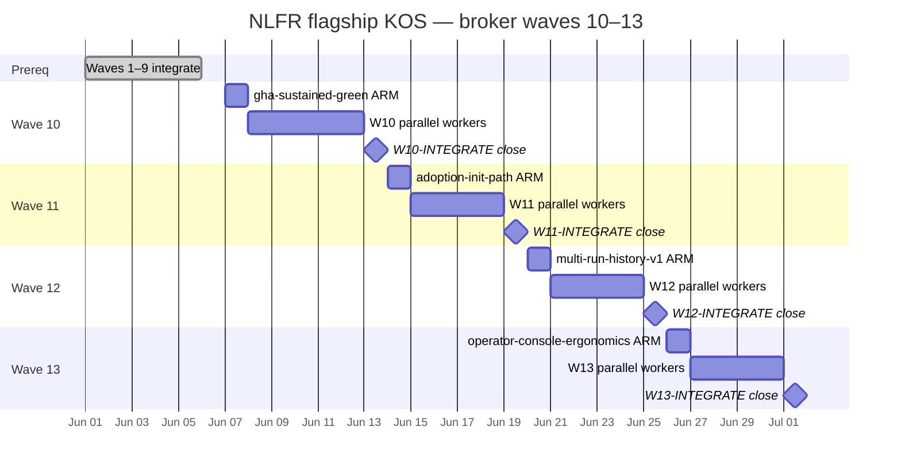

# NLFR flagship KOS roadmap — waves 10–13 (post cutover 1–9)

**Status:** PLANNED (broker ARM after wave 9 `DONE_WITH_CONCERNS` close 2026-06-06)  
**Control plane:** `dag:nlfr-flagship` · `kos serve` · `linear_authority: false`  
**Branch:** `feat/docs-wiki-wave2`  
**Handoffs:** `docs/sessions/handoffs/nlfr-kos-cutover/wave-{10,11,12,13}/` *(planned)*  
**Prior umbrella:** [nlfr-kos-roadmap-waves-5-8.md](nlfr-kos-roadmap-waves-5-8.md) (waves 5–9)  
**Broker contract:** [knowledge-os/agent-os/harness/broker-dispatch-manifest.md](/Users/alecbot/Documents/knowledge-os/agent-os/harness/broker-dispatch-manifest.md)

Linear PER-* tickets are **reference mirrors only**. Wave authority, spawn ledger, and node
closure live on the local KOS control plane (`kos serve`).

---

## Prerequisite (waves 1–9 outcomes)

| Prior wave | Expected ceiling | Honest residual (plan for) |
|------------|------------------|----------------------------|
| W1 `tier1-canvas-polish` | SHIPPED | Design session items closed |
| W2 `agent-provenance-live` | `DONE_WITH_CONCERNS` | M8 live Cursor operator-host gated |
| W3 `lre-linux-manual-proof` | `DONE_WITH_CONCERNS` | LRE Darwin blocker; Linux manual path |
| W4 `ci-restore-verify` | `DONE_WITH_CONCERNS` | GHA offline; runbook shipped |
| W5 `live-proof-residual` | `DONE_WITH_CONCERNS` | Honest M8/LRE blockers refreshed |
| W6 `retention-policy-v1` | SHIPPED | Index-only; no auto-purge |
| W7 `cache-only-ci-gate` | `DONE_WITH_CONCERNS` | Gate script shipped; GHA job optional |
| W8 `pr-proof-attachment` | SHIPPED | Markdown exporter + sample |
| W9 `kos-operator-bridge` | `DONE_WITH_CONCERNS` | dag-gui manifest + gap honesty |

**Explicitly blocked (all waves 10–13):** fleet placement/scheduler parsers, queue-time dashboards,
OTLP clones, multi-tenant auth, auto-purge/TTL jobs.

---

## North star (umbrella 10–13)

Move from **credible local proof kit** to **day-to-day operator workflow** — sustained CI
credibility, lower adoption friction, richer multi-run history, and ergonomic canvas console —
without inventing fleet claims or exceeding the **8-node canvas cap** on default projections.

A skeptic can:

1. Point at a **sustained-green GHA badge** (or honest blocker with promotion matrix).
2. Run **`nlfr init`** on a fresh clone and reach first proof packet in one documented path.
3. Browse **multi-run history** beyond pairwise compare (index + projection views).
4. Operate the canvas with **≤8 default nodes** and clear lens ergonomics.

---

## Wave timeline

```mermaid
flowchart LR
    subgraph prereq["Prereq · waves 1–9"]
        W9["W9 kos-operator-bridge"]
    end

    subgraph w10["Wave 10 · gha-sustained-green"]
        W10WF["W10-GHA-RESTORE"]
        W10PROM["W10-CI-PROMOTE"]
        W10DOC["W10-CI-DOCS"]
        W10INT["W10-INTEGRATE"]
        W10WF --> W10INT
        W10PROM --> W10INT
        W10DOC --> W10INT
    end

    subgraph w11["Wave 11 · adoption-init-path"]
        W11INIT["W11-NLFR-INIT"]
        W11ADP["W11-ADAPTER-PATTERN"]
        W11ONE["W11-ONE-COMMAND"]
        W11INT["W11-INTEGRATE"]
        W11INIT --> W11INT
        W11ADP --> W11INT
        W11ONE --> W11INT
    end

    subgraph w12["Wave 12 · multi-run-history-v1"]
        W12IDX["W12-HISTORY-INDEX"]
        W12PRJ["W12-HISTORY-PROJECTION"]
        W12WIKI["W12-HISTORY-WIKI"]
        W12INT["W12-INTEGRATE"]
        W12IDX --> W12INT
        W12PRJ --> W12INT
        W12WIKI --> W12INT
    end

    subgraph w13["Wave 13 · operator-console-ergonomics"]
        W13CAP["W13-CANVAS-8NODE-CAP"]
        W13LENS["W13-LENS-ERGONOMICS"]
        W13FAIL["W13-FAILURE-MESSAGES"]
        W13INT["W13-INTEGRATE"]
        W13CAP --> W13INT
        W13LENS --> W13INT
        W13FAIL --> W13INT
    end

    prereq --> w10 --> w11 --> w12 --> w13
```





---

## Control plane

| Field | Value |
|-------|-------|
| **DAG ref** | `dag:nlfr-flagship` |
| **Authority** | KOS local primary (`linear_authority: false`) |
| **Serve** | `kos serve http://127.0.0.1:7423` |
| **Seed script** | `tools/orchestrator/scripts/seed_nlfr_flagship_waves_10_13.py` *(planned; Knowledge OS repo)* |
| **Handoff tree** | `docs/sessions/handoffs/nlfr-kos-cutover/wave-{10..13}/` |

Parent broker reads `integration-brief.md` + `worker-results.json` between waves.

---

## Wave 10 — `gha-sustained-green`

| Field | Value |
|-------|-------|
| **Wave id** | `gha-sustained-green` |
| **KOS wave** | 10 |
| **Handoffs** | `docs/sessions/handoffs/nlfr-kos-cutover/wave-10/` |

### Objective

Close the **GHA offline** residual from waves 4 and 7: restore sustained green on
`nlfr-proof.yml` and/or `nlfr-cache-only-gate.yml`, promote CI artifacts per
`CI_PROMOTION_MATRIX.md`, and update gap-honesty when green is observed.

### North star

Contributor sees a green workflow run (or documented honest blocker with exact restore steps).
Local gates remain valid fallback per [`gha-offline-proof-shift.md`](../sessions/handoffs/frontier-wave/wave-1/gha-offline-proof-shift.md).

### KOS node IDs

| Node | Role | Prerequisite |
|------|------|--------------|
| `W10-GHA-RESTORE` | Workflow fixes + sustained green verification | `W9-INTEGRATE` |
| `W10-CI-PROMOTE` | Artifact promotion matrix execution | `W10-GHA-RESTORE` or parallel honest blocker |
| `W10-CI-DOCS` | `GHA_RESTORE_RUNBOOK.md` + `CI_RECIPE.md` sync | `W9-INTEGRATE` |
| `W10-INTEGRATE` | Integration brief + KOS close | all W10 implementers |

### Proof gates

```bash
gh workflow run nlfr-proof.yml
gh workflow run nlfr-cache-only-gate.yml
uv run pytest -q
./scripts/cache-only-ci-gate.sh
```

### Ceiling / stop conditions

| Claim | Label | Gate |
|-------|-------|------|
| Sustained GHA green | `collectable_v1` / `high` | ≥3 consecutive green runs |
| GHA still offline | `collectable_v1` / `high` (negative) | Updated blocker + local gates PASS |
| Bazel on all CI legs | **environment** | Doctor records blocker per leg |

---

## Wave 11 — `adoption-init-path`

| Field | Value |
|-------|-------|
| **Wave id** | `adoption-init-path` |
| **KOS wave** | 11 |
| **Handoffs** | `docs/sessions/handoffs/nlfr-kos-cutover/wave-11/` |

### Objective

Close USEFULNESS_ROADMAP **Gap 1**: lower adoption friction with `nlfr init`, documented
adapter pattern for existing Bazel monorepos, and a one-command record path.

### North star

New evaluator clones repo, runs `nlfr init` (or documented equivalent), and reaches proof
packet + graph export without reading five separate runbooks.

### KOS node IDs

| Node | Role | Prerequisite |
|------|------|--------------|
| `W11-NLFR-INIT` | `nlfr init` scaffold + doctor hook | `W10-INTEGRATE` |
| `W11-ADAPTER-PATTERN` | Monorepo adapter wiki + sample | `W10-INTEGRATE` |
| `W11-ONE-COMMAND` | `record-this-target` script path | `W11-NLFR-INIT` |
| `W11-INTEGRATE` | Integration brief + KOS close | all W11 implementers |

### Proof gates

```bash
PYTHONPATH=src uv run python -m nlfr init --help
./scripts/record-proof.sh
uv run pytest tests/test_init_cmd.py -q   # when lands
```

### Ceiling / stop conditions

| Claim | Label | Gate |
|-------|-------|------|
| Init path on fresh clone | `derived_v1` / `high` | pytest + adoption guide walkthrough |
| Full monorepo migration | **future** | Adapter pattern docs only |
| Live NativeLink required for init | **environment** | Honest doctor blocker |

---

## Wave 12 — `multi-run-history-v1`

| Field | Value |
|-------|-------|
| **Wave id** | `multi-run-history-v1` |
| **KOS wave** | 12 |
| **Handoffs** | `docs/sessions/handoffs/nlfr-kos-cutover/wave-12/` |

### Objective

Extend M9 beyond pairwise compare: run-group browser, multi-run projection views, and proof
packet history surfacing — building on wave 6 retention policy (`index_only`, `no_auto_purge`).

### North star

Operator runs `nlfr compare index` (with `--limit`) and opens a history view or exported
multi-run projection without inventing trend charts or auto-purge.

### KOS node IDs

| Node | Role | Prerequisite |
|------|------|--------------|
| `W12-HISTORY-INDEX` | Enhanced index + run-group metadata | `W11-INTEGRATE` |
| `W12-HISTORY-PROJECTION` | Multi-run projection exporter | `W12-HISTORY-INDEX` |
| `W12-HISTORY-WIKI` | Diátaxis history docs + USEFULNESS Gap 2 sync | `W11-INTEGRATE` |
| `W12-INTEGRATE` | Integration brief + KOS close | all W12 implementers |

### Proof gates

```bash
uv run pytest tests/test_compare.py tests/test_retention_policy.py -q
PYTHONPATH=src uv run python -m nlfr compare index --limit 10
```

### Ceiling / stop conditions

| Claim | Label | Gate |
|-------|-------|------|
| Multi-run index + export | `derived_v1` / `high` | pytest + fixture DBs |
| Auto-purge / TTL | **blocked** | Stop if implementer adds destructive CLI |
| Org-wide trend dashboards | **future** | Out of scope |

---

## Wave 13 — `operator-console-ergonomics`

| Field | Value |
|-------|-------|
| **Wave id** | `operator-console-ergonomics` |
| **KOS wave** | 13 |
| **Handoffs** | `docs/sessions/handoffs/nlfr-kos-cutover/wave-13/` |

### Objective

Close operator-console ergonomics gaps: **8-node canvas cap** on default projections (user
request), lens panel polish, and actionable failure messages when NativeLink/Bazel are missing.

### North star

Default canvas projection renders **at most 8 nodes** on the primary graph view; compare and
table lenses remain accessible; missing-toolchain errors cite doctor output and adoption paths.

### KOS node IDs

| Node | Role | Prerequisite |
|------|------|--------------|
| `W13-CANVAS-8NODE-CAP` | Projector + canvas cap enforcement | `W12-INTEGRATE` |
| `W13-LENS-ERGONOMICS` | Compare/table lens UX polish | `W12-INTEGRATE` |
| `W13-FAILURE-MESSAGES` | CLI doctor + init failure messaging | `W11-INTEGRATE` |
| `W13-INTEGRATE` | Integration brief + KOS close | all W13 implementers |

### Proof gates

```bash
npm --prefix apps/canvas run test:truth
uv run pytest -q
# Default projection node count ≤ 8:
uv run pytest tests/test_canvas_node_cap.py -q   # when lands
```

### Ceiling / stop conditions

| Claim | Label | Gate |
|-------|-------|------|
| 8-node default cap | `derived_v1` / `high` | canvas truth tests + sample projection |
| Full operator console / fleet UI | **blocked** | Ergonomics only; no fleet parsers |
| Unlimited graph nodes on default view | **blocked** | Cap is product constraint |

---

## Parent proof gates (waves 10–13)

```bash
uv run pytest -q
bash -n scripts/*.sh
npm --prefix apps/canvas run test:truth   # when canvas touched
```

Revisit [`gha-offline-proof-shift.md`](../sessions/handoffs/frontier-wave/wave-1/gha-offline-proof-shift.md)
when wave 10 achieves sustained green.

---

## Explicit out of scope (waves 10–13)

- Fleet / scheduler / queue-time parsers and dashboards
- Auto-purge / retention TTL jobs
- Raw prompt, secret, or customer log export
- Harmony dag-gui implementation (cross-repo)
- Linear PER-* as dispatch authority

---

## Handoff index

| Artifact | Path |
|----------|------|
| Waves 1–4 canonical DAG | [`nlfr-kos-roadmap.md`](nlfr-kos-roadmap.md) |
| Waves 5–9 shipped DAG | [`nlfr-kos-roadmap-waves-5-8.md`](nlfr-kos-roadmap-waves-5-8.md) |
| Wave 9 gap honesty | [`gap-honesty-packet.md`](../sessions/handoffs/nlfr-kos-cutover/wave-9/gap-honesty-packet.md) |
| GHA offline policy | [`gha-offline-proof-shift.md`](../sessions/handoffs/frontier-wave/wave-1/gha-offline-proof-shift.md) |
| USEFULNESS gaps | [`USEFULNESS_ROADMAP.md`](../USEFULNESS_ROADMAP.md) |
