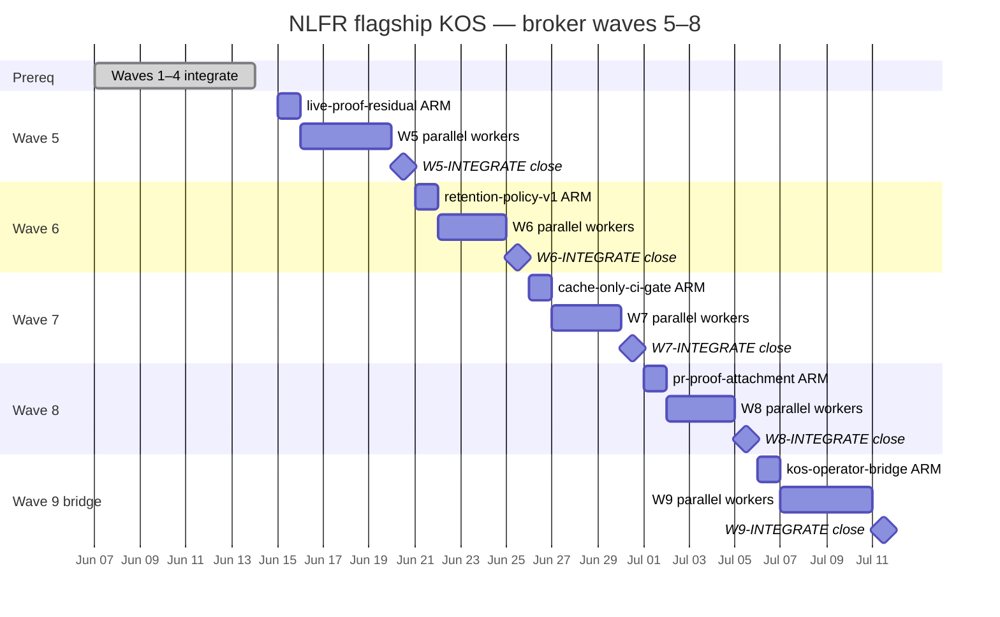

# NLFR flagship KOS roadmap — waves 5–8 (post cutover 1–4)

**Status:** wave-5 PLANNED (broker ARM pending)  
**Control plane:** `dag:nlfr-flagship` · `kos serve` · `linear_authority: false`  
**Branch:** `feat/docs-wiki-wave2` → next `feat/nlfr-kos-waves-5-8` (spawn after waves 1–4 integrate or `DONE_WITH_CONCERNS`)  
**Handoffs:** `docs/sessions/handoffs/nlfr-kos-cutover/wave-5/`  
**Prior umbrella:** [nlfr-kos-roadmap.md](nlfr-kos-roadmap.md) (waves 1–4)  
**Broker contract:** [knowledge-os/agent-os/harness/broker-dispatch-manifest.md](/Users/alecbot/Documents/knowledge-os/agent-os/harness/broker-dispatch-manifest.md)

Linear PER-* tickets are **reference mirrors only**. Wave authority, spawn ledger, and node
closure live on the local KOS control plane (`kos serve`).

---

## Prerequisite (waves 1–4 outcomes)

| Prior wave | Expected ceiling | Honest residual (plan for) |
|------------|------------------|----------------------------|
| W1 `tier1-canvas-polish` | SHIPPED | Design session items 1–4 closed |
| W2 `agent-provenance-live` | `collectable_v1` live **or** `environment-blocker` sample | M8 live Cursor on operator host may remain gated |
| W3 `lre-linux-manual-proof` | Linux `lre_cache_parity_observed` sample **or** blocker | x86_64-linux Nix green may remain operator-owned |
| W4 `ci-restore-verify` | sustained GHA green **or** `blocked` on KOS | GHA may still be offline; full `nlfr-proof.yml` not required for 5–8 |
| docs-wiki-wave2 | SHIPPED | Contracts wiki + compare sample done |

**Explicitly blocked (all waves 5–8):** fleet placement/scheduler parsers, queue-time dashboards,
OTLP clones, multi-tenant auth. Research-matrix sync only — no new collectable parser workers.

---

## North star (umbrella 5–8)

Close **operator-adoptable** gaps between a credible local proof kit and day-to-day engineering
workflow — without inventing fleet claims or blocking on full CI restore.

A skeptic can:

1. Read an honest **retention policy** (index-only, no fake auto-purge).
2. See **`nlfr doctor --mode cache-only`** as a minimal, PR-safe CI gate.
3. Attach a **redacted proof-packet markdown** summary to a PR review.
4. Open **`dag:nlfr-flagship`** in the operator GUI handoff tree (dag-gui bridge) with residual
   live-proof gaps documented — not hidden.

---

## Wave timeline



> **Note:** Waves 5–8 in broker numbering map to KOS nodes `W5-*` … `W8-*`. The dag-gui bridge
> is **wave 9** in the continuation plan but **KOS wave 8** node prefix `W8-KOS-BRIDGE` is avoided;
> use **`W9-*`** in seed scripts when extending past PR attachment. This document's **wave 8** is
> `pr-proof-attachment`; **wave 9** `kos-operator-bridge` is listed for dag-gui coupling — broker
> may ARM it as a fifth umbrella immediately after wave 8 or fold into wave 8 integrate brief.

```mermaid
flowchart LR
    subgraph prereq["Prereq · waves 1–4"]
        W1["W1 tier1-canvas-polish"]
        W2["W2 agent-provenance-live"]
        W3["W3 lre-linux-manual-proof"]
        W4["W4 ci-restore-verify"]
        W1 --> W2 --> W3 --> W4
    end

    subgraph w5["Wave 5 · live-proof-residual"]
        W5M8["W5-M8-LIVE"]
        W5LRE["W5-LRE-LINUX"]
        W5DOC["W5-LIVE-DOCS"]
        W5INT["W5-INTEGRATE"]
        W5M8 --> W5INT
        W5LRE --> W5INT
        W5DOC --> W5INT
    end

    subgraph w6["Wave 6 · retention-policy-v1"]
        W6POL["W6-RETENTION-POLICY"]
        W6CLI["W6-RETENTION-CLI"]
        W6WIKI["W6-RETENTION-WIKI"]
        W6INT["W6-INTEGRATE"]
        W6POL --> W6INT
        W6CLI --> W6INT
        W6WIKI --> W6INT
    end

    subgraph w7["Wave 7 · cache-only-ci-gate"]
        W7WF["W7-CACHE-GATE-WF"]
        W7SCR["W7-CACHE-GATE-SCRIPT"]
        W7DOC["W7-CACHE-GATE-DOCS"]
        W7INT["W7-INTEGRATE"]
        W7WF --> W7INT
        W7SCR --> W7INT
        W7DOC --> W7INT
    end

    subgraph w8["Wave 8 · pr-proof-attachment"]
        W8EXP["W8-PR-EXPORTER"]
        W8SMP["W8-PR-SAMPLE"]
        W8REC["W8-PR-RECIPE"]
        W8INT["W8-INTEGRATE"]
        W8EXP --> W8INT
        W8SMP --> W8INT
        W8REC --> W8INT
    end

    subgraph w9["Wave 9 · kos-operator-bridge"]
        W9MAN["W9-CUTOVER-MANIFEST"]
        W9HOF["W9-HANDOFF-BRIDGE"]
        W9HON["W9-GAP-HONESTY"]
        W9INT["W9-INTEGRATE"]
        W9MAN --> W9INT
        W9HOF --> W9INT
        W9HON --> W9INT
    end

    prereq --> w5 --> w6 --> w7 --> w8 --> w9
```



---

## Control plane

| Field | Value |
|-------|-------|
| **DAG ref** | `dag:nlfr-flagship` |
| **Authority** | KOS local primary (`linear_authority: false`) |
| **Serve** | `kos serve http://127.0.0.1:7423` |
| **Seed script** | `tools/orchestrator/scripts/seed_nlfr_flagship_waves_5_8.py` (Knowledge OS repo; operator-owned) |
| **Handoff tree** | `docs/sessions/handoffs/nlfr-kos-cutover/wave-{5..9}/` |
| **dag-gui coupling** | [dag-gui-v2 W5 broker-native loop](/Users/alecbot/Documents/knowledge-os/docs/sessions/handoffs/dag-gui-research/wave-plan-2-5.md) — NLFR repo supplies manifest + handoff paths only |

Parent broker reads `integration-brief.md` + `worker-results.json` between waves. Coordinators
return `DispatchManifest` JSON only; parent is sole spawn authority.

---

## Wave 5 — `live-proof-residual`

| Field | Value |
|-------|-------|
| **Wave id** | `live-proof-residual` |
| **dag_ref** | `nlfr-flagship` |
| **KOS wave** | 5 |
| **Handoffs** | `docs/sessions/handoffs/nlfr-kos-cutover/wave-5/` |

### Objective

Close **residual collectable gaps** from waves 2–3 on the operator host: M8 live Cursor session
(non-dry-run) and x86_64-linux LRE cold/warm green — or promote honest `environment-blocker`
samples with updated operator runbooks. No fake `collectable_v1` runs.

### North star

Skeptic opens `docs/proof-samples/agent-live-*` and `lre-cold-warm-proof-linux-sample.json`
and can tell whether evidence is **live**, **manual Linux**, or **honest blocker** — with
`evidence_refs` pointing at real commands.

### Coordinators

| coordinator_id | Sub-DAG | write_scope |
|----------------|---------|-------------|
| `coord-m8-live-residual` | M8 live Cursor retry + sample | `scripts/agent-live-proof.sh`, `scripts/record-agent-change.sh` (live-path flags only) |
| `coord-lre-linux-residual` | Linux LRE green or blocker promote | `scripts/lre-cold-warm-proof.sh`, `docs/proof-samples/lre-cold-warm-proof-*` |
| `coord-live-proof-docs` | Operator runbooks + proof-samples README | `adapters/cursor/README.md`, `docs/LRE_LINUX_PROOF.md`, `docs/proof-samples/README.md` (M8/LRE sections only) |
| `coord-live-proof-tests` | Contract tests for live/blocker paths | `tests/test_agent_live_proof.py`, `tests/test_lre_proof.py` |

Disjoint scopes: scripts coordinators do not edit adapter README; docs coordinator does not edit
`scripts/*.sh`.

### KOS node IDs

| Node | Role | Prerequisite |
|------|------|--------------|
| `W5-M8-LIVE` | Non-dry-run Cursor proof or blocker refresh | `W4-INTEGRATE` (or `DONE_WITH_CONCERNS`) |
| `W5-LRE-LINUX` | x86_64-linux LRE sample or blocker refresh | `W4-INTEGRATE` |
| `W5-LIVE-DOCS` | Operator runbooks sync (parallel after W4) | `W4-INTEGRATE` |
| `W5-INTEGRATE` | Integration brief + KOS close | `W5-M8-LIVE`, `W5-LRE-LINUX`, `W5-LIVE-DOCS` |

### Proof gates (local; GHA optional)

```bash
./scripts/record-agent-change.sh --dry-run
./scripts/agent-live-proof.sh
./scripts/lre-cold-warm-proof.sh --help
uv run pytest tests/test_agent_live_proof.py tests/test_lre_proof.py -q
bash -n scripts/agent-live-proof.sh scripts/lre-cold-warm-proof.sh
```

### Ceiling / stop conditions

| Claim | Label | Gate |
|-------|-------|------|
| M8 live Cursor on operator host | `collectable_v1` / `high` | Real adapter stdout + `chain_complete=true` |
| M8 live unavailable | `collectable_v1` / `high` | `environment-blocker.json` with `cursor` absence |
| LRE linux parity | `collectable_v1` / `medium` | Manual Nix green OR promoted redacted sample |
| Fleet / scheduler correlation | **blocked** | Stop if worker requests new parsers |

**Stop wave** with `DONE_WITH_CONCERNS` when both paths produce honest blockers — do not block
waves 6–8.

---

## Wave 6 — `retention-policy-v1`

| Field | Value |
|-------|-------|
| **Wave id** | `retention-policy-v1` |
| **dag_ref** | `nlfr-flagship` |
| **KOS wave** | 6 |
| **Handoffs** | `docs/sessions/handoffs/nlfr-kos-cutover/wave-6/` |

### Objective

Document and implement **honest v1 retention semantics** for M9: index-only discovery, explicit
no-auto-purge policy, optional `--limit` on `compare index`, and proof-packet retention notes —
without building purge jobs or multi-run trend dashboards.

### North star

Operator runs `nlfr compare index` and reads wiki policy: artifacts are local-only; index lists
groups; unsupported claims stay labeled; growth is operator-managed.

### Coordinators

| coordinator_id | Sub-DAG | write_scope |
|----------------|---------|-------------|
| `coord-retention-policy-core` | Policy module + proof packet hook | `src/nlfr/retention_policy.py` (new), `src/nlfr/projectors/proof_packet.py` (retention block only) |
| `coord-retention-cli` | CLI flags + help text | `src/nlfr/commands/compare_cmd.py` (`index --limit`), `src/nlfr/commands/ingest_cmd.py` (policy note in `--help` only if touched) |
| `coord-retention-wiki` | Wiki + roadmap sync | `docs/wiki/how-to/export-and-compare-run-groups.md`, `docs/wiki/reference/contracts/compare-projection-v1.md`, `docs/USEFULNESS_ROADMAP.md` (Gap 2 rows only) |
| `coord-retention-tests` | Fixture-backed policy tests | `tests/test_retention_policy.py` (new), `tests/test_compare.py` (index limit cases only) |

### KOS node IDs

| Node | Role | Prerequisite |
|------|------|--------------|
| `W6-RETENTION-POLICY` | Policy constants + proof packet retention block | `W5-INTEGRATE` |
| `W6-RETENTION-CLI` | `compare index --limit` + honest CLI messaging | `W5-INTEGRATE` |
| `W6-RETENTION-WIKI` | Diátaxis retention docs (parallel) | `W5-INTEGRATE` |
| `W6-INTEGRATE` | Integration brief + KOS close | all W6 implementers |

### Proof gates

```bash
uv run pytest tests/test_retention_policy.py tests/test_compare.py -q
PYTHONPATH=src uv run python -m nlfr compare index --help
PYTHONPATH=src uv run python -m nlfr compare index --db data/record-proof/nlfr.sqlite --limit 5
```

### Ceiling / stop conditions

| Claim | Label | Gate |
|-------|-------|------|
| Retention index with limit | `derived_v1` / `high` | pytest + CLI |
| Auto-purge / TTL deletion | **blocked** | Stop if implementer adds destructive CLI |
| Multi-run trend charts | **future** | Out of scope |

---

## Wave 7 — `cache-only-ci-gate`

| Field | Value |
|-------|-------|
| **Wave id** | `cache-only-ci-gate` |
| **dag_ref** | `nlfr-flagship` |
| **KOS wave** | 7 |
| **Handoffs** | `docs/sessions/handoffs/nlfr-kos-cutover/wave-7/` |

### Objective

Land a **minimal PR-safe CI gate** — `nlfr doctor --mode cache-only` — independent of full
`nlfr-proof.yml` restore. Provides credibility while GHA remains partially offline.

### North star

Contributor opens PR and sees (or runs locally) a single fast job that proves the cache-only
doctor path is healthy; failure means misconfiguration, not unsupported fleet claims.

### Coordinators

| coordinator_id | Sub-DAG | write_scope |
|----------------|---------|-------------|
| `coord-cache-gate-script` | Local gate script | `scripts/cache-only-ci-gate.sh` (new) |
| `coord-cache-gate-workflow` | Lightweight workflow job | `.github/workflows/nlfr-cache-only-gate.yml` (new) |
| `coord-cache-gate-docs` | CI_RECIPE + adoption path | `docs/CI_RECIPE.md`, `docs/ADOPTION_GUIDE.md` (cache-only gate section only), `docs/GHA_RESTORE_RUNBOOK.md` (gate vs full restore note) |
| `coord-cache-gate-tests` | Doctor JSON contract test | `tests/test_doctor_cache_only_gate.py` (new) |

### KOS node IDs

| Node | Role | Prerequisite |
|------|------|--------------|
| `W7-CACHE-GATE-SCRIPT` | `cache-only-ci-gate.sh` mirrors doctor JSON checks | `W6-INTEGRATE` |
| `W7-CACHE-GATE-WF` | Optional GHA job (honest `blocked` if GHA offline) | `W7-CACHE-GATE-SCRIPT` |
| `W7-CACHE-GATE-DOCS` | Recipe docs (parallel after script) | `W6-INTEGRATE` |
| `W7-INTEGRATE` | Integration brief + KOS close | all W7 implementers |

### Proof gates

```bash
./scripts/cache-only-ci-gate.sh
uv run pytest tests/test_doctor_cache_only_gate.py -q
bash -n scripts/cache-only-ci-gate.sh
# When GHA available:
gh workflow run nlfr-cache-only-gate.yml
```

### Ceiling / stop conditions

| Claim | Label | Gate |
|-------|-------|------|
| cache-only doctor on PR | `collectable_v1` / `high` | script + optional workflow artifact |
| Full nlfr-proof.yml green | **deferred** | Wave 4 owns; do not block wave 7 close |
| Bazel/NativeLink on CI | **environment** | Doctor records blocker; job exits non-zero only on validation failure |

---

## Wave 8 — `pr-proof-attachment`

| Field | Value |
|-------|-------|
| **Wave id** | `pr-proof-attachment` |
| **dag_ref** | `nlfr-flagship` |
| **KOS wave** | 8 |
| **Handoffs** | `docs/sessions/handoffs/nlfr-kos-cutover/wave-8/` |

### Objective

Close USEFULNESS_ROADMAP **Gap 3**: export a **redacted markdown proof summary** suitable for PR
comments — links to manifest, projection JSON paths, truth labels; exit-code policy separates
validation failure from unsupported boundary labels.

### North star

Reviewer pastes generated markdown into a PR (or CI step uploads it) and sees proof claims with
`source_kind` / `confidence` without raw logs or prompts.

### Coordinators

| coordinator_id | Sub-DAG | write_scope |
|----------------|---------|-------------|
| `coord-pr-markdown-exporter` | CLI + shell wrapper | `src/nlfr/commands/proof_cmd.py` (`export --format markdown` or new subcommand), `scripts/export-pr-proof-comment.sh` (new) |
| `coord-pr-sample-promote` | Committed sample markdown | `docs/proof-samples/pr-proof-comment-sample.md` (new), `docs/proof-samples/README.md` (PR section only) |
| `coord-pr-attachment-wiki` | How-to + CI recipe | `docs/wiki/how-to/attach-proof-to-pr.md` (new), `docs/CI_RECIPE.md` (PR attachment section only) |
| `coord-pr-exporter-tests` | Redaction + schema tests | `tests/test_pr_proof_markdown.py` (new) |

### KOS node IDs

| Node | Role | Prerequisite |
|------|------|--------------|
| `W8-PR-EXPORTER` | Markdown exporter + shell wrapper | `W7-INTEGRATE` |
| `W8-PR-SAMPLE` | Redacted PR comment sample | `W8-PR-EXPORTER` |
| `W8-PR-RECIPE` | Wiki how-to + CI_RECIPE (parallel) | `W7-INTEGRATE` |
| `W8-INTEGRATE` | Integration brief + KOS close | all W8 implementers |

### Proof gates

```bash
./scripts/export-pr-proof-comment.sh --run-group latest
uv run pytest tests/test_pr_proof_markdown.py -q
bash -n scripts/export-pr-proof-comment.sh
# Sample must pass redaction scan (no prompt bodies, no /Users paths)
```

### Ceiling / stop conditions

| Claim | Label | Gate |
|-------|-------|------|
| PR markdown summary | `derived_v1` / `high` | pytest + committed sample |
| GitHub PR comment bot | **future** | Out of scope unless trivial `gh pr comment` wrapper lands in exporter coordinator |
| Unsupported claims as failures | **blocked** | Boundary labels must not fail export |

---

## Wave 9 — `kos-operator-bridge` (dag-gui coupling)

| Field | Value |
|-------|-------|
| **Wave id** | `kos-operator-bridge` |
| **dag_ref** | `nlfr-flagship` |
| **KOS wave** | 9 |
| **Handoffs** | `docs/sessions/handoffs/nlfr-kos-cutover/wave-9/` |
| **Cross-repo** | dag-gui-v2 W5 (`W5-W4` NLFR cutover manifest) |

### Objective

NLFR-side readiness for **dag-gui** operator loop: cutover manifest entry, handoff path
correlation for `dag:nlfr-flagship` nodes, and integrative **gap honesty packet** (GHA, fleet
parsers blocked, M8/LRE residuals). No Harmony/Electron code in this repo.

### North star

Operator opens Harmony DAG Ops, picks `dag:nlfr-flagship`, clicks `W5-M8-LIVE`, and lands on
the correct `docs/sessions/handoffs/nlfr-kos-cutover/wave-5/` integration brief.

### Coordinators

| coordinator_id | Sub-DAG | write_scope |
|----------------|---------|-------------|
| `coord-kos-cutover-manifest` | NLFR manifest + routing | `docs/sessions/handoffs/nlfr-kos-cutover/wave-9/cutover-manifest.json` (new), `docs/sessions/handoffs/nlfr-kos-cutover/wave-9/KOS-startup-routing.md` |
| `coord-kos-handoff-bridge` | Per-wave handoff index | `docs/sessions/handoffs/nlfr-kos-cutover/wave-*/integration-brief.md` (index doc only: `docs/sessions/handoffs/nlfr-kos-cutover/README.md`) |
| `coord-kos-gap-honesty` | Residual gap packet | `docs/sessions/handoffs/nlfr-kos-cutover/wave-9/gap-honesty-packet.md`, `docs/dags/future-execution-ladder.md` (blocked rows), `docs/dags/README.md` (waves 5–9 row) |
| `coord-kos-umbrella-integrate` | Waves 1–9 umbrella close | `docs/sessions/handoffs/nlfr-kos-cutover/wave-9/integration-brief.md`, `docs/dags/nlfr-kos-roadmap-waves-5-8.md` (status), `docs/dags/nlfr-kos-roadmap.md` (forward link) |

### KOS node IDs

| Node | Role | Prerequisite |
|------|------|--------------|
| `W9-CUTOVER-MANIFEST` | `cutover-manifest.json` for dag-gui DagPicker | `W8-INTEGRATE` |
| `W9-HANDOFF-BRIDGE` | Handoff path map per KOS node id | `W8-INTEGRATE` |
| `W9-GAP-HONESTY` | Fleet/GHA/M8/LRE honesty sync | `W8-INTEGRATE` |
| `W9-INTEGRATE` | Umbrella 1–9 close | all W9 implementers |

### Proof gates

```bash
python3 -m json.tool docs/sessions/handoffs/nlfr-kos-cutover/wave-9/cutover-manifest.json
curl -sS 'http://127.0.0.1:7423/v1/dag/dag%3Anlfr-flagship/frontier'
uv run pytest -q   # parent gate; no new product code required
```

### Ceiling / stop conditions

| Claim | Label | Gate |
|-------|-------|------|
| dag-gui handoff correlation | `derived_v1` / `medium` | manifest + KOS frontier smoke |
| Live Harmony GUI features | **cross-repo** | dag-gui-v2 W5 owns implementation |
| Fleet parser implementation | **blocked** | Honesty packet only |

---

## Parent proof gates (waves 5–9)

Local gates substitute for full CI while GHA offline:

```bash
uv run pytest -q
bash -n scripts/*.sh
npm --prefix apps/canvas run test:truth   # only if canvas touched (not expected)
```

Revisit [gha-offline-proof-shift.md](../sessions/handoffs/frontier-wave/wave-1/gha-offline-proof-shift.md)
when wave 4 or wave 7 workflow jobs go green.

---

## Explicit out of scope (waves 5–9)

- Fleet / scheduler / queue-time parsers and dashboards
- Auto-purge / retention TTL jobs
- Raw prompt, secret, or customer log export
- Harmony dag-gui implementation (Knowledge OS + harmony-session-fleet repos)
- Linear PER-* as dispatch authority

---

## Handoff index

| Artifact | Path |
|----------|------|
| Waves 5–8 plan (handoff mirror) | [`four-wave-plan-5-8.md`](../sessions/handoffs/nlfr-kos-cutover/wave-5/four-wave-plan-5-8.md) |
| Waves 1–4 canonical DAG | [`nlfr-kos-roadmap.md`](nlfr-kos-roadmap.md) |
| dag-gui continuation | [knowledge-os dag-gui wave-plan-2-5](/Users/alecbot/Documents/knowledge-os/docs/sessions/handoffs/dag-gui-research/wave-plan-2-5.md) |
| GHA offline policy | [`gha-offline-proof-shift.md`](../sessions/handoffs/frontier-wave/wave-1/gha-offline-proof-shift.md) |
| Fleet parser blocker | [`future-execution-ladder.md`](future-execution-ladder.md) |

---

## Broker ARM checklist (wave-5)

1. Confirm waves 1–4 `integration-brief.md` landed (or `DONE_WITH_CONCERNS` with blockers named).
2. Spawn `feat/nlfr-kos-waves-5-8` from current flagship branch.
3. Seed `dag:nlfr-flagship` nodes (`W5-*` … `W9-*`) via `seed_nlfr_flagship_waves_5_8.py`.
4. Write `docs/sessions/handoffs/nlfr-kos-cutover/wave-5/broker-arm.md` + spawn ledger.
5. Dispatch wave 5 coordinators in parallel — **do not** block on GHA green or fleet parsers.
