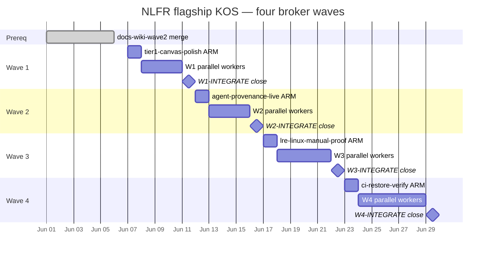

# NLFR flagship KOS roadmap — four waves post docs-wiki-wave2

**Status:** wave-0 PLANNED (broker ARM pending)  
**Control plane:** `dag:nlfr-flagship` · `kos serve` · `linear_authority: false`  
**Branch:** `feat/nlfr-kos-cutover` (spawn from merged `feat/docs-wiki-wave2`)  
**Handoffs:** `docs/sessions/handoffs/nlfr-kos-cutover/wave-0/`  
**Broker contract:** [knowledge-os/agent-os/harness/broker-dispatch-manifest.md](/Users/alecbot/Documents/knowledge-os/agent-os/harness/broker-dispatch-manifest.md)

Linear PER-* tickets are **reference mirrors only** for this umbrella. Wave authority,
spawn ledger, and node closure live on the local KOS control plane (`kos serve`).

---

## Prerequisite (shipped)

| Prior work | Branch | Ceiling |
|------------|--------|---------|
| Docs excellence / wiki wave 2 | `feat/docs-wiki-wave2` | Flagship Diátaxis wiki, Harmony README, adoption paths, diagrams, proof-samples hub |
| M5–M9 substrate | `main` | Backend + canvas compare/worker/agent spine (`human-design-handoff.md`) |
| LRE substrate + cold/warm scripts | `main` | `lre_cache_parity_observed` script path; CI green deferred (GHA offline) |

---

## North star (umbrella)

Close the four highest-leverage gaps between **credible local proof kit** and **day-to-day
adoptable reference architecture** — without inventing fleet/scheduler claims or blocking
on CI green while GHA remains offline.

A skeptic can:

1. Open a polished tier1 canvas with honest run-group selection.
2. Point at one **non-dry-run** agent change with collectable provenance.
3. Inspect a **redacted x86_64-linux LRE parity sample** (manual or CI).
4. Re-derive proof claims from promoted CI samples when GHA returns.

---

## Wave timeline

```mermaid
flowchart LR
    subgraph prereq["Prereq"]
        W2DOC["docs-wiki-wave2"]
    end

    subgraph w1["Wave 1 · tier1-canvas-polish"]
        W1UX["W1-CANVAS-UX"]
        W1SEL["W1-RUN-SELECTOR"]
        W1SHOT["W1-SCREENSHOTS"]
        W1INT["W1-INTEGRATE"]
        W1UX --> W1INT
        W1SEL --> W1INT
        W1SHOT --> W1INT
    end

    subgraph w2["Wave 2 · agent-provenance-live"]
        W2E2E["W2-AGENT-E2E"]
        W2PROOF["W2-AGENT-PROOF"]
        W2DOC2["W2-ADAPTER-DOCS"]
        W2INT["W2-INTEGRATE"]
        W2E2E --> W2INT
        W2PROOF --> W2INT
        W2DOC2 --> W2INT
    end

    subgraph w3["Wave 3 · lre-linux-manual-proof"]
        W3RUN["W3-LINUX-RUNBOOK"]
        W3SAMPLE["W3-SAMPLE-PROMOTE"]
        W3SYNC["W3-LADDER-SYNC"]
        W3INT["W3-INTEGRATE"]
        W3RUN --> W3INT
        W3SAMPLE --> W3INT
        W3SYNC --> W3INT
    end

    subgraph w4["Wave 4 · ci-restore-verify"]
        W4GHA["W4-GHA-RESTORE"]
        W4PROMO["W4-PROOF-PROMOTE"]
        W4DOCS["W4-CI-DOCS"]
        W4INT["W4-INTEGRATE"]
        W4GHA --> W4INT
        W4PROMO --> W4INT
        W4DOCS --> W4INT
    end

    W2DOC --> w1 --> w2 --> w3 --> w4
```





---

## Control plane

| Field | Value |
|-------|-------|
| **DAG ref** | `nlfr-flagship` |
| **Authority** | KOS local primary (`linear_authority: false`) |
| **Serve** | `kos serve` (kos-mcp) — node status, frontier epoch, `apply_status_batch` |
| **Seed script** | `tools/orchestrator/scripts/seed_nlfr_flagship_wave{N}.py` (Knowledge OS repo; operator-owned) |
| **Handoff tree** | `docs/sessions/handoffs/nlfr-kos-cutover/wave-{n}/` |

Parent broker reads `integration-brief.md` + `worker-results.json` between waves. Coordinators
return `DispatchManifest` JSON only; parent is sole spawn authority.

---

## Wave 1 — `tier1-canvas-polish`

| Field | Value |
|-------|-------|
| **Wave id** | `tier1-canvas-polish` |
| **dag_ref** | `nlfr-flagship` |
| **KOS wave** | 1 |
| **Linear mirror** | *(none — KOS authority)* |
| **Handoffs** | `docs/sessions/handoffs/nlfr-kos-cutover/wave-1/` |

### Objective

Human-design pass on tier1 canvas: compare lens polish, run-group selector UX, typography/density
on Proof Drawer and Remote Boundary lens — **projection JSON only**, no invented backend state.

### North star

Evaluator opens `?view=tier1-demo`, selects run groups from `nlfr compare index` output (or
committed index fixture), and sees visually coherent compare/worker/proof surfaces with updated
screenshot baselines.

### Coordinators

| coordinator_id | Sub-DAG | write_scope |
|----------------|---------|-------------|
| `coord-canvas-ux-polish` | Compare + worker + lens styling | `apps/canvas/src/components/**`, `apps/canvas/src/styles/**` |
| `coord-run-group-selector` | Run selector UX | `apps/canvas/src/**/RunSelector*`, `apps/canvas/public/views/**` |
| `coord-canvas-screenshots` | Baseline capture | `scripts/record-canvas-build.sh`, `apps/canvas/tests/**`, `docs/images/canvas/**` |
| `coord-canvas-readme` | Canvas operator docs | `apps/canvas/README.md` |

Disjoint scopes: UX polish must not touch RunSelector files; selector coordinator owns selector
component tree only.

### KOS node IDs

| Node | Role | Prerequisite |
|------|------|--------------|
| `W1-CANVAS-UX` | Compare lens, worker nodes, Proof Drawer density | wave-0 ARM |
| `W1-RUN-SELECTOR` | Run-group selector from compare index fixture/API shape | wave-0 ARM |
| `W1-SCREENSHOTS` | Screenshot baselines + truth test updates | `W1-CANVAS-UX`, `W1-RUN-SELECTOR` |
| `W1-INTEGRATE` | Integration brief + KOS close | all W1 implementers |

### Proof gates (local; GHA offline)

```bash
npm --prefix apps/canvas run test:truth
npm --prefix apps/canvas run build
./scripts/record-canvas-build.sh
uv run pytest -q   # if canvas test helpers touched
```

### Ceiling / stop conditions

| Claim | Label | Gate |
|-------|-------|------|
| Run selector shows indexed run groups | `derived_v1` / `medium` | Fixture or CLI-exported index only |
| Compare lens visual polish | `simulated_v1` → layout | Must not add unsupported compare dimensions |
| Live backend / fleet state in UI | **blocked** | Stop if selector invents SQLite rows not in projection |

**Stop wave** if run-selector requires new backend API beyond projection JSON export.

---

## Wave 2 — `agent-provenance-live`

| Field | Value |
|-------|-------|
| **Wave id** | `agent-provenance-live` |
| **dag_ref** | `nlfr-flagship` |
| **KOS wave** | 2 |
| **Linear mirror** | M8 reference only ([m8-agent-adapter.md](m8-agent-adapter.md)) |
| **Handoffs** | `docs/sessions/handoffs/nlfr-kos-cutover/wave-2/` |

### Objective

One **non-dry-run** agent change through `record-agent-change.sh` → generic run → ingest →
graph export with real (redacted) stdout capture and collectable `agent_provenance` block.

### North star

Same graph chain shape as deterministic `llm-bounded-patch`, but provenance is
`collectable_v1` from a real adapter invocation — model label + prompt hash only, never raw prompt.

### Coordinators

| coordinator_id | Sub-DAG | write_scope |
|----------------|---------|-------------|
| `coord-agent-live-e2e` | Full E2E proof path | `scripts/record-agent-change.sh`, `scripts/agent-live-proof.sh` (new) |
| `coord-agent-proof-samples` | Redacted samples | `docs/proof-samples/agent-live-*`, `data/agent-live-proof/` (gitignored run dir + sample only) |
| `coord-agent-adapter-docs` | Adapter operator docs | `adapters/cursor/**` |
| `coord-agent-live-tests` | Contract tests | `tests/test_record_agent_change.py`, `tests/test_agent_live_proof.py` (new) |

### KOS node IDs

| Node | Role | Prerequisite |
|------|------|--------------|
| `W2-AGENT-E2E` | Non-dry-run script + redacted stdout capture | `W1-INTEGRATE` |
| `W2-AGENT-PROOF` | `summary.json` + proof sample promotion | `W2-AGENT-E2E` |
| `W2-ADAPTER-DOCS` | Cursor adapter runbook (parallel) | `W1-INTEGRATE` |
| `W2-INTEGRATE` | Integration brief + KOS close | all W2 implementers |

### Proof gates (local; GHA offline)

```bash
./scripts/record-agent-change.sh --dry-run   # regression
./scripts/agent-live-proof.sh                # new — non-dry-run or honest blocker
uv run pytest tests/test_record_agent_change.py tests/test_agent_live_proof.py -q
./scripts/record-proof.sh                    # chain still green
```

### Ceiling / stop conditions

| Claim | Label | Gate |
|-------|-------|------|
| Agent change recorded non-dry-run | `collectable_v1` / `high` | `chain_complete=true` in summary |
| Prompt content stored | **blocked** | Stop if raw prompt appears in artifacts |
| Live LLM reasoning as proof | **blocked** | Provenance is claim source, not validation proof |

**Stop wave** with `environment-blocker.json` if Cursor CLI unavailable on host — document blocker;
do not fake collectable run.

---

## Wave 3 — `lre-linux-manual-proof`

| Field | Value |
|-------|-------|
| **Wave id** | `lre-linux-manual-proof` |
| **dag_ref** | `nlfr-flagship` |
| **KOS wave** | 3 |
| **Linear mirror** | [lre-proof.md](lre-proof.md) phase 4 |
| **Handoffs** | `docs/sessions/handoffs/nlfr-kos-cutover/wave-3/` |

### Objective

Produce and promote one **redacted x86_64-linux** LRE cold/warm parity sample
(`lre_cache_parity_observed`) via manual Nix host or operator Linux VM — independent of GHA green.

### North star

Skeptic opens `docs/proof-samples/lre-cold-warm-proof-linux-sample.json` and matches schema to
`scripts/lre-cold-warm-proof.sh` output without the author's Mac.

### Coordinators

| coordinator_id | Sub-DAG | write_scope |
|----------------|---------|-------------|
| `coord-lre-linux-runbook` | Manual Linux proof procedure | `docs/LRE_LINUX_PROOF.md` (new), `docs/DEV_ENVIRONMENT.md` (LRE section only) |
| `coord-lre-sample-promote` | Sample promotion | `docs/proof-samples/lre-cold-warm-proof-*-sample.json`, `docs/proof-samples/README.md` |
| `coord-lre-ladder-sync` | DAG + ladder honesty | `docs/dags/lre-proof.md`, `docs/dags/future-execution-ladder.md` (LRE rows only) |

### KOS node IDs

| Node | Role | Prerequisite |
|------|------|--------------|
| `W3-LINUX-RUNBOOK` | Operator runbook for x86_64-linux Nix path | `W2-INTEGRATE` |
| `W3-SAMPLE-PROMOTE` | Redacted summary sample from manual green or honest blocker sample | `W3-LINUX-RUNBOOK` |
| `W3-LADDER-SYNC` | LRE ceiling docs sync (parallel after runbook) | `W2-INTEGRATE` |
| `W3-INTEGRATE` | Integration brief + KOS close | all W3 implementers |

### Proof gates (local; GHA offline)

```bash
uv run pytest tests/test_lre_proof.py -q
bash -n scripts/lre-cold-warm-proof.sh
# Optional on x86_64-linux host with Nix (operator-owned, not broker-blocking):
nix develop --command ./scripts/lre-cold-warm-proof.sh
```

### Ceiling / stop conditions

| Claim | Label | Gate |
|-------|-------|------|
| LRE cold/warm on x86_64-linux | `collectable_v1` / `medium` | Manual host green OR redacted sample from prior green run |
| LRE parity from CI artifact | **deferred** | Wave 4 owns CI promotion |
| Fleet / scheduler / queue time | **blocked** | No new parsers in this wave |
| aarch64-darwin full LRE green | **blocked** | Blocker sample remains valid |

**Stop wave** with promoted `environment-blocker.json` sample if no Linux host available — honest
outcome; do not claim parity without evidence.

---

## Wave 4 — `ci-restore-verify`

| Field | Value |
|-------|-------|
| **Wave id** | `ci-restore-verify` |
| **dag_ref** | `nlfr-flagship` |
| **KOS wave** | 4 |
| **Linear mirror** | M5 reference ([m5-ci-proof.md](m5-ci-proof.md)) |
| **Handoffs** | `docs/sessions/handoffs/nlfr-kos-cutover/wave-4/` |

### Objective

Restore sustained green on `.github/workflows/nlfr-proof.yml`, verify jobs match local proof gates,
and promote redacted CI summaries into `docs/proof-samples/`.

### North star

First sustained green GHA run produces artifacts that match local `summary.json` schemas; README
and CI_RECIPE cite promoted samples with truth labels — CI status becomes ship gate again.

### Coordinators

| coordinator_id | Sub-DAG | write_scope |
|----------------|---------|-------------|
| `coord-gha-restore` | Workflow repair + job alignment | `.github/workflows/nlfr-proof.yml`, `scripts/*-ci-proof.sh` |
| `coord-ci-proof-promote` | Artifact → proof-samples | `docs/proof-samples/**`, `docs/proof-samples/README.md` |
| `coord-ci-docs-sync` | Docs + offline shift reversal | `docs/CI_RECIPE.md`, `docs/USEFULNESS_ROADMAP.md`, `docs/dags/README.md`, `docs/sessions/handoffs/frontier-wave/wave-1/gha-offline-proof-shift.md` (status note) |

### KOS node IDs

| Node | Role | Prerequisite |
|------|------|--------------|
| `W4-GHA-RESTORE` | Fix workflow until sustained green | `W3-INTEGRATE` |
| `W4-PROOF-PROMOTE` | Promote redacted CI summaries | `W4-GHA-RESTORE` (at least one green run) |
| `W4-CI-DOCS` | CI_RECIPE + roadmap sync (parallel after restore starts) | `W3-INTEGRATE` |
| `W4-INTEGRATE` | Umbrella close + ship packet | all W4 implementers |

### Proof gates

**While GHA still offline** (wave ARM): local gates only per
[gha-offline-proof-shift.md](../sessions/handoffs/frontier-wave/wave-1/gha-offline-proof-shift.md).

**After GHA restore** (wave close):

```bash
# Trigger or wait for nlfr-proof.yml green on PR branch
gh run list --workflow=nlfr-proof.yml --limit 5
uv run pytest -q
./scripts/record-proof.sh
./scripts/tier1-bazel-ci-proof.sh
./scripts/compare-proof.sh
```

### Ceiling / stop conditions

| Claim | Label | Gate |
|-------|-------|------|
| CI Linux cold/warm + tier1 bazel | `collectable_v1` | Green workflow artifact matches local schema |
| LRE cold/warm CI green | `collectable_v1` / `medium` | `lre-cold-warm-ci` job artifact promoted |
| CI always green | **not guaranteed** | Stop with `DONE_WITH_CONCERNS` if flaky; document retry policy |
| PR comment exporter | **future** | Out of scope unless trivial markdown script lands in promote coordinator |

**Stop wave** without claiming CI green if workflows remain offline — leave wave 4 `blocked` on
KOS frontier; waves 1–3 remain shippable independently.

---

## Parent proof gates (all waves)

Local gates substitute for CI while GHA offline:

```bash
uv run pytest -q
bash -n scripts/*.sh
npm --prefix apps/canvas run test:truth
```

Revisit offline shift when wave 4 closes or operator declares GHA restored.

---

## Explicit out of scope (all four waves)

- Fleet / scheduler / queue-time dashboards
- New direct-evidence parsers beyond existing M7 stdout path
- Multi-tenant auth, billing, OTLP clones
- Linear PER-* ticket creation as dispatch authority
- Raw prompt, secret, or customer log export

---

## Handoff index

| Artifact | Path |
|----------|------|
| Wave-0 four-wave plan (KOS mirror) | [`four-wave-plan.md`](../sessions/handoffs/nlfr-kos-cutover/wave-0/four-wave-plan.md) |
| Prior human design brief | [`human-design-handoff.md`](../sessions/handoffs/m5-m9-umbrella/wave-4/human-design-handoff.md) |
| Usefulness priorities | [`USEFULNESS_ROADMAP.md`](../USEFULNESS_ROADMAP.md) |
| Execution ladder | [`future-execution-ladder.md`](future-execution-ladder.md) |
| GHA offline policy | [`gha-offline-proof-shift.md`](../sessions/handoffs/frontier-wave/wave-1/gha-offline-proof-shift.md) |

---

## Broker ARM checklist (wave-0)

1. Merge `feat/docs-wiki-wave2` → spawn `feat/nlfr-kos-cutover`.
2. Seed `dag:nlfr-flagship` nodes (`W1-*` … `W4-*`) via `kos serve`.
3. Write `docs/sessions/handoffs/nlfr-kos-cutover/wave-0/broker-arm.md` + spawn ledger.
4. Set `linear_authority: false` on cutover manifest.
5. Dispatch wave 1 coordinators in parallel — **do not** block on Linear or CI.
