# Agent loop provenance

**Caption:** Bounded agent patch → validation run → ingest → graph chain. Provenance is `collectable_v1` when `scripts/agent-loop-proof.sh` succeeds; prompt content stays hashed/redacted per privacy rules.

```mermaid
flowchart LR
    subgraph agent["Agent leg — collectable_v1"]
        SC["Scenario\nllm-bounded-patch"]
        CP["Copied workspace\n(never mutates source)"]
        PATCH["Bounded patch\nmodel label + prompt SHA-256"]
        SC --> CP --> PATCH
    end

    subgraph validate["Validation — collectable_v1"]
        BZ["Bazel via NativeLink cache"]
        RUN["Run + artifact capture"]
        PATCH --> BZ --> RUN
    end

    subgraph ingest["Ingest — collectable_v1"]
        SIM["nlfr simulate --ingest"]
        SQL["SQLite\nchanges + runs + cache events"]
        RUN --> SIM --> SQL
    end

    subgraph project["Project — derived_v1"]
        AG["agent node\nfrom agent_provenance block"]
        CH["change node"]
        RN["run / target / action"]
        CE["cache_event node"]
        SQL --> AG
        AG -->|authored_change| CH
        CH -->|validated_by| RN
        RN --> CE
    end

    style agent fill:#e8f4e8
    style validate fill:#e8f4e8
    style ingest fill:#e8f4e8
    style project fill:#e8eef8
```



## Honesty notes

| Element | `source_kind` | `confidence` | Claim boundary |
|---------|---------------|--------------|----------------|
| Patch application | `collectable_v1` | `high` | Scenario JSON + change row; raw prompt never stored |
| Bazel validation run | `collectable_v1` | `high` | Cache-mode evidence only in v1 proof path |
| `agent_provenance` block | `collectable_v1` | `high` | Model name + prompt hash + change refs |
| Graph `agent` node | `derived_v1` | `medium` | Derived from proof block + `changes` table |
| `authored_change` / `validated_by` edges | `derived_v1` | `medium` | Projector linkage — not live agent session state |

**Privacy:** `redaction_state` = `redacted` for prompt fields (hash only). Do not export raw prompts, credentials, or customer data.

**Not claimed:** agent marketplace, multi-agent fleet orchestration, live Cursor/Bazel E2E unless proof artifact attached.

**Testable command:**

```bash
nix develop --command ./scripts/agent-loop-proof.sh
# Evidence: data/agent-loop-proof/summary.json — chain_complete=true
```

**Evidence refs:** `demo/scenarios/llm-bounded-patch.json`, `data/agent-loop-proof/summary.json`, `src/nlfr/projectors/graph.py`, `scripts/record-agent-change.sh --provenance-sidecar`.
