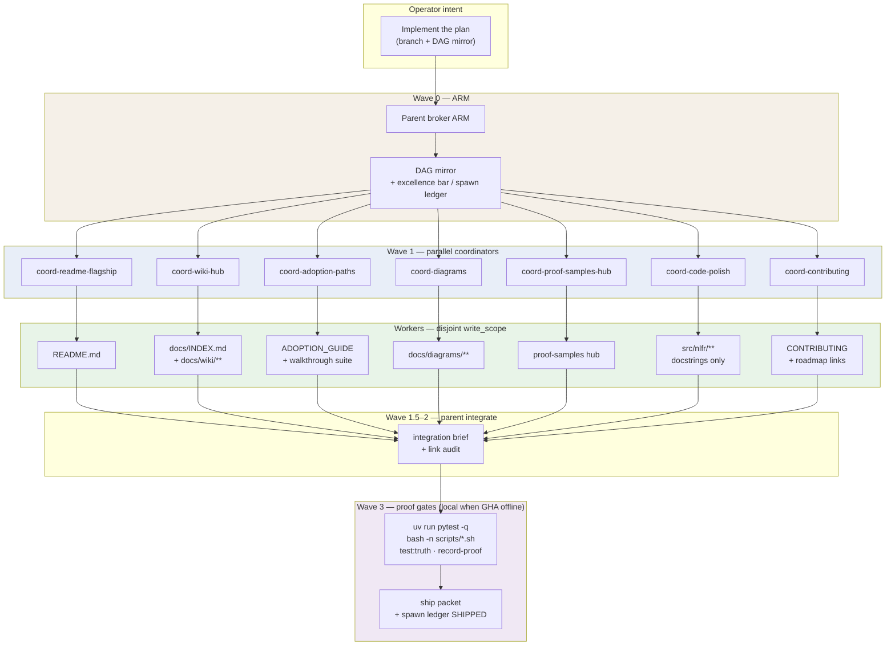

# Broker orchestration

**Caption:** Knowledge OS parent-broker pattern for multi-DAG milestones (e.g. docs excellence, frontier wave). Coordinators return `DispatchManifest` JSON only; workers own disjoint `write_scope` paths. Proof gates at ship are **host-local** when GHA is offline — not live scheduler or fleet claims.

## Honesty notes

| Stage | What is orchestrated | What is **not** orchestrated |
|-------|----------------------|------------------------------|
| Parent broker | Parallel doc/code polish sub-DAGs with disjoint paths | Live NativeLink scheduler, worker placement, queue time |
| Coordinators | Spawn workers; collect manifests | Rewrite product truth labels or invent fleet claims |
| Workers | Files in `write_scope` only | Cross-scope edits without parent merge |
| Proof gates | Local pytest, shell syntax, canvas truth tests | Green CI badge as ship blocker while GHA offline |

**Contract:** [broker-dispatch-manifest](https://github.com/heyitsalec/knowledge-os/blob/main/agent-os/harness/broker-dispatch-manifest.md) (Knowledge OS). NLFR mirrors: [`docs/dags/docs-excellence.md`](../dags/docs-excellence.md), handoffs under `docs/sessions/handoffs/`.

**Maintainer-only:** Operators evaluating NLFR proof do not need this diagram. See [Evidence loop](evidence-loop.md) for the product spine.

**Evidence refs:** `docs/sessions/handoffs/docs-excellence/wave-1/integration-brief.md`, `docs/dags/docs-excellence.md`, `docs/sessions/handoffs/docs-excellence/wave-0/broker-arm.md`.
