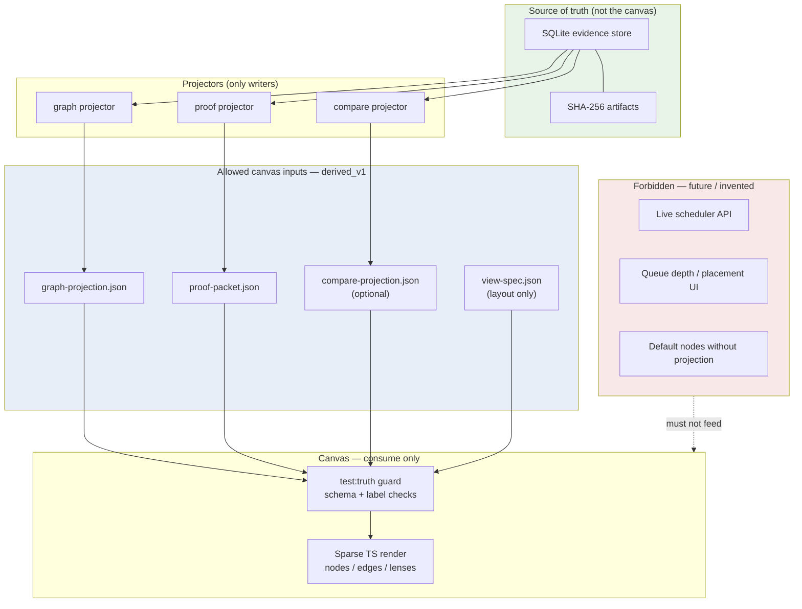

# Canvas projection boundary

**Caption:** The canvas is a read-only consumer of exported projection JSON. It must not invent backend state, poll live schedulers, or treat UI state as source of truth.



## Honesty notes

| Boundary | Rule | `source_kind` on canvas claims |
|----------|------|--------------------------------|
| Input files | Canvas reads projection JSON from `public/projections/` or fetch path only | Inherits `derived_v1` from projectors |
| Truth labels | Every rendered node/edge must expose four fields | Same as projection payload |
| View spec | Layout and lens routing — not evidentiary claims | `derived_v1` or layout metadata; no collectable claims |
| Screenshots / demos | Must come from fixture projection or labeled dry-run | `simulated_v1` when fixture; label explicitly |
| Operator panel | Shows export hints and empty states — not live fleet | `derived_v1` |

**Anti-pattern:** Canvas as source of truth. If a node is visible, it must exist in projection JSON with `evidence_refs` pointing to collectable or derived sources.

**Guard command:**

```bash
npm --prefix apps/canvas run test:truth
```

**Evidence refs:** `apps/canvas/src/App.tsx`, `apps/canvas/src/panels/OperatorPanel.tsx`, `AGENTS.md` product rule, `docs/ARCHITECTURE_TRACK.md` Principle 1 gate "Consume".
