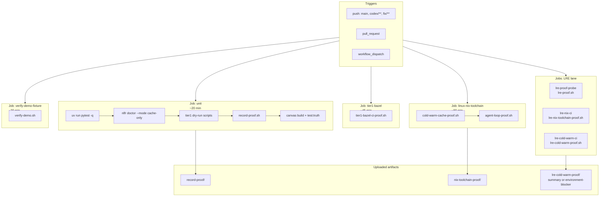

# CI proof lane

**Caption:** `.github/workflows/nlfr-proof.yml` lanes exercise the evidence spine on `ubuntu-latest`. **As of 2026-06-06, GHA is treated as offline/non-green** — local gates substitute for CI; do not block ship on workflow green.



## GHA offline — operator notes

| Topic | Policy while GHA offline |
|-------|--------------------------|
| Ship / merge gate | **Local only:** `uv run pytest -q`, `bash -n scripts/*.sh`, DAG-specific proof scripts |
| CI green badge | **Not required** — do not document workflows as passing until they actually pass |
| `lre-cold-warm-ci` green | **Deferred** — cite blocker sample or manual Linux+Nix run; not a broker-blocking gate |
| LRE parity claim | Script + tests + blocker samples supported locally; `lre_cache_parity_observed` from CI **not claimed** |
| Revisit trigger | First sustained green on `nlfr-proof.yml` or operator declares GHA restored |

**Local substitute matrix:**

```bash
# Parent proof gates (always)
uv run pytest -q
bash -n scripts/*.sh

# Canvas / record path
./scripts/record-proof.sh
npm --prefix apps/canvas run test:truth

# Optional when Nix available
nix develop --command ./scripts/cold-warm-cache-proof.sh
nix develop --command ./scripts/agent-loop-proof.sh
nix develop --command ./scripts/lre-cold-warm-proof.sh
```

## Honesty notes

| Lane | `source_kind` when job succeeds | `confidence` | When job fails / GHA offline |
|------|--------------------------------|--------------|------------------------------|
| `unit` + `record-proof` | `collectable_v1` | `high` | Local `record-proof.sh` + pytest prove same boundary |
| `linux-nix-toolchain` | `collectable_v1` | `high` | Run scripts in `nix develop` on host; defer CI artifact |
| `tier1-bazel` | `collectable_v1` | `high` | `environment-blocker.json` is honest outcome |
| `lre-*` jobs | `collectable_v1` or blocker artifact | `medium` | Do not claim CI green; use `docs/proof-samples/lre-cold-warm-proof-blocker-sample.json` |
| `verify-demo-fixture` | `simulated_v1` | `medium` | Fixture path — not live Bazel proof |

**Evidence refs:** `.github/workflows/nlfr-proof.yml`, `data/*/summary.json`, `data/*/environment-blocker.json`.
