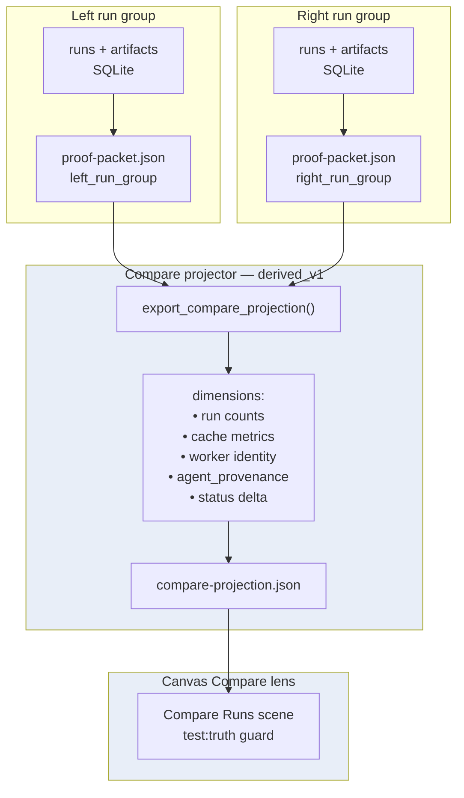

# Compare projection flow

**Caption:** Multi-run compare is a `derived_v1` projection built from two proof packets — not a new truth source. The canvas Compare lens loads `compare-projection.json` only.



## Honesty notes

| Output | `source_kind` | `confidence` | Claim boundary |
|--------|---------------|--------------|----------------|
| `compare-projection.json` | `derived_v1` | `medium` | Deltas between two exported proof packets |
| Dimension: cache metrics | `derived_v1` | `medium` | Reflects collectable cache blocks in each packet |
| Dimension: worker identity | `derived_v1` | `medium` | Presence/absence only — not placement correlation |
| Dimension: agent_provenance | `derived_v1` | `medium` | Block presence — not raw prompt or model reasoning |
| Compare lens UI | `derived_v1` | `medium` | Renders exported JSON; empty state if file missing |

**Not invented:** cross-run scheduler correlation, queue-time deltas, or fleet placement — compare dimensions mirror what each proof packet already collected.

**Testable commands:**

```bash
python3 -m nlfr compare export \
  --left-run-group <left> \
  --right-run-group <right> \
  --output apps/canvas/public/projections/compare-projection.json
./scripts/compare-proof.sh
./scripts/compare-agent-runs.sh --dry-run
npm --prefix apps/canvas run test:truth
```

**Evidence refs:** `run_group:<left>`, `run_group:<right>`, `src/nlfr/projectors/compare.py`, `apps/canvas/public/projections/compare-projection.json`.
