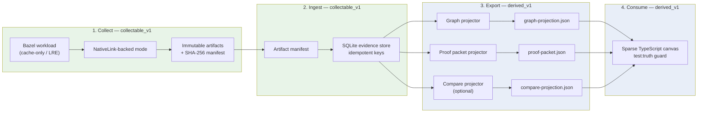

# Evidence loop

**Caption:** Canonical NLFR spine — from Bazel workload to canvas projection. Steps 1–3 produce `collectable_v1` rows; steps 4–5 produce `derived_v1` projection JSON; the canvas consumes projection only.



## Honesty notes

| Stage | `source_kind` | `confidence` | Claim boundary |
|-------|---------------|--------------|----------------|
| Bazel + NativeLink capture | `collectable_v1` | `high` when proof script succeeds | Artifacts and hashes only — not scheduler placement |
| SQLite ingest | `collectable_v1` | `high` | Idempotent rows with stable keys; no invented rows |
| Projectors | `derived_v1` | `medium`–`high` | Computed from SQLite; must carry four truth labels |
| Canvas render | `derived_v1` | `medium` | Reads projection JSON files only; never polls live backend |

**Out of scope for this diagram:** worker queue time, action placement, fleet dashboards, OTLP/Jaeger clones. Those require direct evidence parsers before any node appears in projection JSON.

**Testable commands:**

```bash
python3 -m nlfr doctor --mode cache-only
./scripts/record-proof.sh
python3 -m nlfr graph export --run-group latest
python3 -m nlfr proof export --run-group latest
npm --prefix apps/canvas run test:truth
```

**Evidence refs:** `run_group:*`, `artifact:*`, `script:record-proof.sh`, projector output paths under `data/*/projections/`.
