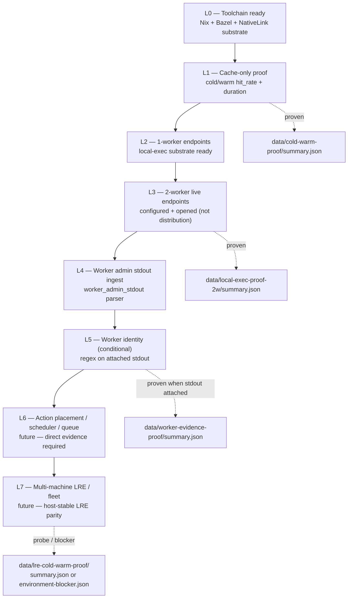

# Execution ladder

**Caption:** Remote-execution and cache claims climb one rung at a time. Each completed step has `collectable_v1` proof (`summary.json` + pytest). Rungs above the current ceiling are `future` — not projected until direct evidence exists.

## Honesty notes

| Rung | Status | `source_kind` | `confidence` | Honest ceiling |
|------|--------|---------------|--------------|----------------|
| L0 toolchain | Proven in Nix | `collectable_v1` | `high` | Substrate starts; not workload economics |
| L1 cache economics | Proven | `collectable_v1` | `high` | `hit_rate`, duration deltas — not "10× faster" rhetoric |
| L2 1-worker endpoints | Proven | `collectable_v1` | `high` | Endpoints ready |
| L3 2-worker live | Proven | `collectable_v1` | `high` | Two workers configured and endpoints opened — **not** work distribution |
| L4 stdout ingest | Proven (M7) | `collectable_v1` | `high` | Parser rows in SQLite |
| L5 worker identity | Conditional | `collectable_v1` | `high` when stdout pre-attached | Identity from admin stdout regex — not scheduler |
| L6 placement / queue | **Unsupported** | `future` | `unknown` | No graph nodes without new parsers |
| L7 LRE / fleet | Partial probe | `collectable_v1` or blocker | `medium` | LRE cold/warm wired; local proof gates canonical until CI restore |

**Stop rules:** If a rung would report a blocker as success, stop — architectural violation. Canvas (L3 consume) must not add claims the ladder did not collect.

**Evidence refs:** `docs/ARCHITECTURE_TRACK.md` Phase 2–3, `scripts/cold-warm-cache-proof.sh`, `scripts/local-exec-proof.sh`, `scripts/worker-evidence-proof.sh`, `scripts/lre-cold-warm-proof.sh`.
