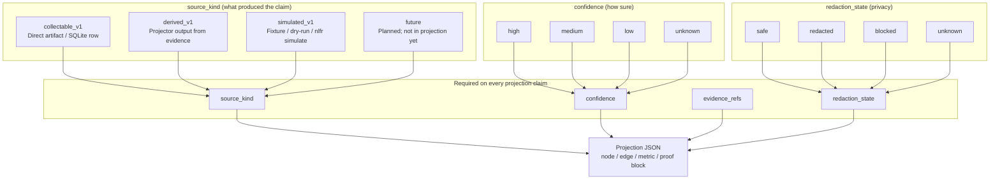

# Truth label ladder

**Caption:** Every projected node, edge, metric, and proof claim carries four truth-label fields. `source_kind` sets the epistemic floor; `confidence` and `redaction_state` qualify how operators should read the claim.

## Honesty notes

| `source_kind` | When to use | Example in NLFR | Do not claim |
|---------------|-------------|-------------------|--------------|
| `collectable_v1` | Immutable capture with SHA-256 or direct parser row | `summary.json`, cache `hit_rate`, worker stdout identity | Scheduler assignment without stdout evidence |
| `derived_v1` | Projector computed from collectable rows | Graph edges, compare dimensions, proof summaries | Live backend state absent from SQLite |
| `simulated_v1` | Fixture replay, `--dry-run`, `nlfr simulate` | Demo scripts with `NLFR_SKIP_BAZEL=1` | Same confidence as a live Nix proof run |
| `future` | Documented intent only | Multi-tenant SaaS, fleet queue UI | Any field in shipped projection JSON |

| `redaction_state` | Meaning |
|-------------------|---------|
| `safe` | No secrets, raw prompts, or private paths in export |
| `redacted` | Hash or span only (e.g. prompt SHA-256, path prefix) |
| `blocked` | Claim withheld — privacy or policy |
| `unknown` | Redaction not evaluated |

**Rule from AGENTS.md:** Do not claim exact worker/action/queue-time correlation unless direct evidence exists in parsers and proof scripts.

**Diagram labels:** `source_kind` = `derived_v1`, `confidence` = `high` (schema documentation), `redaction_state` = `safe`.

**Evidence refs:** `AGENTS.md`, `src/nlfr/projectors/common.py` (`truth()` helper), `npm --prefix apps/canvas run test:truth`.
